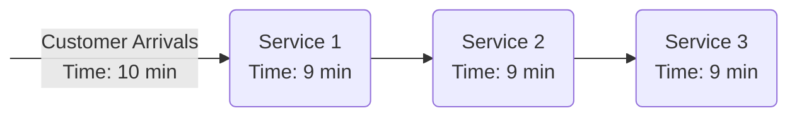

# Simulation

[Merriam-Webster](https://www.merriam-webster.com/dictionary/simulation) dictionary defines the simlation to be:
> a) the imitative representation of the functioning of one system or process by means of the functioning of another
> 
> b) examination of a problem often not subject to direct experimentation by means of a simulating device

In this presentation we assume to be able to use computers in the imitation or examination process.

## What is Computer Simulation?

Computer simulation refers to the process of creating and running a computer-based model or representation of a real-world system, phenomenon, process, or event. It involves using mathematical algorithms, data, and computer programs to imitate the behavior and interactions of the real system over time. The primary purpose of computer simulation is to gain insights, predictions, or a better understanding of how the real system would behave under different conditions or scenarios.

Computer simulations can vary widely in complexity and scope, ranging from simple mathematical models to highly sophisticated, detailed representations. They are used in various fields, including:

- **Science and Engineering**: Simulations are used to study and predict the behavior of physical systems, such as the movement of planets, the flow of fluids, or the behavior of materials under different conditions. For example, engineers might use simulations to design and test new products, structures, or systems before building physical prototypes.

- **Medicine**: Medical simulations are employed for training medical professionals, understanding the effects of diseases, testing new drugs, and even performing virtual surgeries.

- **Environmental Studies**: Simulations help scientists model and predict the effects of various factors on ecosystems, climate, and environmental processes.

- **Social Sciences**: Sociologists, economists, and political scientists use simulations to study human behavior, social interactions, economic systems, and policy impacts.

- **Entertainment and Gaming**: Video games often involve intricate simulations of virtual worlds, characters, and physics to provide immersive experiences.

- **Aerospace and Defense**: Simulations are used to design and test aircraft, spacecraft, and military systems in a controlled and cost-effective environment.

- **Business and Logistics**: Organizations use simulations to optimize supply chains, forecast demand, and test business strategies in a risk-free virtual environment.

- **Education and Training**: Simulations are widely used in education to provide hands-on experiences and practical training in various fields, from driving to flight training.

Computer simulations can provide valuable insights that might be difficult, expensive, or even dangerous to obtain through real-world experimentation. They allow researchers, engineers, and decision-makers to explore "what-if" scenarios, test hypotheses, and make informed decisions without affecting the actual system. However, it's important to note that simulations are only as accurate as the models and data used, and they may have limitations in representing certain aspects of complex systems.

### Difference between simulation and imitation

The terms "imitation" and "simulation" are related concepts but have distinct meanings:

#### Imitation:

_Imitation_ refers to the act of replicating or copying the appearance, behavior, or characteristics of something else. It involves mimicking the external or observable aspects of a system or object without necessarily capturing its underlying mechanisms or processes. Imitation can be done manually by humans or by machines. It often focuses on reproducing specific features or behaviors without necessarily understanding the deeper principles or dynamics involved. The Strip in Las Vegas is full of imitations: the Eiffel Tower, the New York skyline, Venice and so on.

In the context of artificial intelligence and robotics, imitation learning is a technique where a machine learns a task by observing and imitating the actions performed by a human or another agent. For example, a robot might learn to pick up objects by watching a human perform the task.

#### Simulation:

_Simulation_, as previously explained, involves creating a (computer-based) model or representation of a real-world system or process. There is a difference between the concepts of a _static simulation_, which imitates a system at a point in time, and a _dynamic simulation_, which imitates a system as it progresses through time. The term simulation is mostly used in the context of dynamic simulation.

It aims to capture the behavior, interactions, and dynamics of the system over time. Simulations are based on mathematical algorithms and data and provide a virtual environment in which various scenarios and conditions can be tested and studied. Simulations can encompass both the observable behaviors and the underlying processes of a system.

Unlike imitation, simulation often involves more comprehensive and detailed modeling of the system's inner workings. It allows researchers to study the cause-and-effect relationships, explore different variables, and make predictions about the system's behavior under different conditions.

In summary, while both imitation and simulation involve replicating aspects of a system, imitation focuses on reproducing observable behaviors, while simulation aims to create a virtual representation that captures both behaviors and underlying processes, often for the purpose of studying and understanding the system's behavior under various scenarios.

### Computer-based dynamic simulation

Computer-based dynamic simulation can be defined as follows:
>_Computer-based dynamic simulation_ is an imitation (on a computer) of a system as it progresses through time.

#### System

In general terms (Coyle, R.G.: "System Dynamics Modelling: A Practical Approach", Chapman & Hall, 1996):
>A _system_ is a collection of parts organized for some purpose.

The weather system, for instance, is a collection of parts, including the sun, water and land, that is designed for the purpose of maintaining life. There have been identified four main classes of system (Checkland, P.: "Systems Thinking, Systems Practice", Wiley, 1981):
- _Natural systems_: systems whose origins lie in the origins of the universe, e.g. the atom,
the Earth’s weather system and galactic systems.
- _Designed physical systems_: physical systems that are a result of human design, e.g. a house,
a car and a production facility.
- _Designed abstract systems_: abstract systems that are a result of human design, e.g. mathematics and literature.
- _Human activity systems_: systems of human activity that are consciously, or unconsciously,
ordered, e.g. a family, a city and political systems.

##### Operational system 

All such systems can be, and indeed are, simulated. In this course, however, we are concerned with
simulation of _designed physical_ and _human activity systems_. Many situations cannot be defined simply as either a designed physical system or a human activity system, but they lie at the interface between the two. A bank, for instance, consists of a designed physical system (the service counters, automatic tellers, etc.), but it is also a human activity system where the staff and customers interact between and with one another. For instance, service operations (banks, call centres and supermarkets), manufacturing plants, supply chains, transport systems, hospital emergency departments and military operations all involve elements of both classes of system. In general terms, these systems can be referred to as operations systems or operating systems (Wild, R.: "Operations Management", Continuum, 2002).
>‘‘An operations/operating system is a configuration of resources [parts] combined for the provision of goods or services [purpose]’’.

#### Simulation model

A simulation simply predicts the performance of an operations system under a specific set of inputs.
For instance, it might predict the average waiting time for telephone customers at a call centre when a specific number of operators are employed. We need a _simulation model_ which simplifies the real-world system. It is the job of the person using the simulation model to vary the inputs (the number of operators) and to run the model in order to determine the effect. As such, simulation is an experimental approach to modelling, that is, a ‘‘what-if’’ analysis tool. The model user enters a scenario and the model predicts the outcome. The model user continues to explore alternative scenarios until he/she has obtained sufficient understanding or identified how to improve the real system.

The **purpose** of simulation can be thus stated as:
>Experimentation with a simplified imitation (on a computer) of an operations system as it progresses through time, for the purpose of better understanding and/or improving that system.

## Why Simulate?

### Variability

Many operations systems are subject to _variability_. This might be predictable variations, for
instance, changing the number of operators in a call centre during the day to meet changing
call volumes or planned stoppages in a production facility. It might also be variations that
are unpredictable, such as the arrival rate of patients at a hospital emergency department or
the breakdown of equipment in a flexible manufacturing cell. Both forms of variability are
present in most operations systems.

### Interconnectedness

Operations systems are also _interconnected_. Components of the system do not work in
isolation, but affect one another. A change in one part of a system leads to a change in
another part of the system. For instance, if a machine is set to work faster this is likely to
cause a reduction in work-in-progress up-stream and a build-up of parts down-stream.

It is often difficult to predict the effects of the interconnections in a system, especially when variability is present. Take the following example. Customers in a service process pass through three (interconnected) stages (figure above). Each stage takes exactly 9 minutes. Customers arrive exactly every 10 minutes. What is the average time a customer spends in the system? This is a relatively simple question to answer, since there is no variability in the system. The average time customers spend in the system is 27 minutes; in fact each customer spends exactly 27 minutes in the system.

Now assume that the times given above are averages, so customers arrive on **average** every 10 minutes, and it takes on **average** 9 minutes to serve a customer at each stage. What is the average time a customer spends in the system? This is not an easy question to answer since there is variability in both customer arrivals and service times. It is also
expected that queues will develop between the service stages. Added to this, the range of variability around the average is not known. Most people would estimate that the average is still 27 minutes or maybe slightly longer. In fact, assuming a typical range of [variability](https://www.statisticshowto.com/exponential-distribution/), the average is near to 150 minutes. The compound effect of variability and the interconnections in the system make it very difficult to predict the overall performance of the system.

### Complexity

Many operations systems are also complex. Often it is useful to distinguish between _combinatorial complexity_ and _dynamic complexity_. Combinatorial complexity is related to the number of components in a system or the number of combinations of system components that are possible.
Combinatorial complexity is present in some operations systems. Take, for instance, a job shop. Parts are processed through a series of machines. Once the processing is complete on one machine, a part is passed to any one of the other machines, depending on the type of part and the next process required. The more machines there are in the job shop, the more the potential interconnections. As the number of machines increases, so the interconnections increase at an even faster rate. If there are two interconnections between any two machines since parts can move in either direction. The total number of interconnections can be calculated as n(n − 1), where n is the number of machines in the job shop.

On the other hand, dynamic complexity is not necessarily related to size. Dynamic complexity arises from the interaction of components in a system over time. This can occur in systems that are small, as well as large. Systems that are highly interconnected are likely to display dynamic complexity. Dynamic complexity can be demonstrated with the ‘‘beer distribution game’’. This represents a simple supply chain consisting of a retailer, wholesaler and factory. The retailer orders cases of beer from the wholesaler, who in turn orders beer from the factory. There is a delay between placing an order and receiving the cases of beer. The game demonstrates that a small perturbation in the number of beer cases sold by the retailer can cause large shifts in the quantity of cases stored and produced by the wholesaler and factory respectively. Such a system is subject to dynamic complexity. There are three effects of dynamic complexity:
- An action has dramatically different effects in the short and long run.
- An action has a very different set of consequences in one part of the system to another.
- An action leads to non-obvious consequences (counter intuitive behaviour).

These effects make it very difficult to predict the performance of a system when actions are taken, or changes are made.

### The need for simulation

Many operations systems are interconnected and subject to both variability and complexity (combinatorial and dynamic). Because it is difficult to predict the performance of systems that are subject to any one of variability, interconnectedness and complexity, it is very difficult, if not impossible, to predict (using a mathematical closed form solution) the performance of operations systems that are potentially subject to all three. Simulation models, however, are able explicitly to represent the variability, interconnectedness and complexity of a system. As a result, it is possible with a simulation to predict system performance, to compare alternative system designs and to determine the effect of alternative policies on system performance.

### The advantages of simulation

Simulation is not the only method of analysing and improving operations systems. In particular, there are two other possible options:
- it might be possible to experiment with the real system, or
- to use analytic (mathematically) methods

What are the specific advantages of simulation over these approaches?
- _Cost_. Experimentation with the real system is likely to be costly. It is expensive to interrupt day-to-day operations in order to try out new ideas. Apart from the cost of making changes, it may be necessary to shut the system down for a period while alterations are made.  With a simulation, however, changes can be made at the cost of the time it takes to alter the model and without any interruption to the operation of the real world system.
- _Time_. It is time consuming to experiment with a real system. It may take many weeks or months (possibly more) before a true reflection of the performance of the system can be obtained. Faster experimentation also enables many ideas to be explored in a short time frame.
- _Control of the experimental conditions_. When comparing alternatives, it is useful to control the conditions under which the experiments are performed so direct comparisons can be made. This is difficult when experimenting with the real system. For instance, it is not possible to control the arrival of patients at a hospital. It is also likely that experimentation with the real system will lead to the [Hawthorne effect](https://en.wikipedia.org/wiki/Hawthorne_effect), where staff performance improves simply because some attention is being paid to them. In some cases the real system only occurs once, for example, Helsinki Olympics, and so there is no option to repeat an experiment. With a simulation model the conditions under which an experiment is performed can be repeated many times.
- _The real system does not exist_. A most obvious difficulty with real world experimentation
is that the real system may not yet exist. Apart from building a series of alternative real
world systems, which is unlikely to be practical in any but the most trivial of situations,
direct experimentation is impossible in such circumstances. The only alternative is to
develop a model.

### The disadvantages of simulation

There are a number of problems with using simulation and these must not be ignored when
deciding whether or not it is appropriate.
- _Expensive_. Simulation software is not necessarily cheap, and the cost of model development and use may be considerable, particularly if consultants have to be employed. But in this course we'll do it by ourselves.
- _Time-consuming_. It has already been stated that simulation model creations is a time-consuming approach. We'll create simplified simulation models within our time limits.
- _Data hungry_. Most simulation models require a significant amount of data. This is not always immediately available and, where it is, much analysis may be required to put it in a form suitable for the simulation. In this course we'll make simplifying assumptions to reduce data requirements.
- _Requires expertise_. Simulation modelling is more than the development of a computer program or the use of a software package. It requires skills in, among other things, conceptual modelling, validation and statistics. After this course you may be interested in statistics.
- _Overconfidence_. There is a danger that anything produced on a computer is seen to
  be right. With simulation this is further exacerbated with the use of an animated
  display, giving an appearance of reality. When interpreting the results from a simulation,
  consideration must be given to the validity of the underlying model and the assumptions
  and simplifications that have been made.

## What kind of simulations we'll have on this course

In general, simulation models are used to describe queueing systems. These are systems where a customer arrives at a service point and has to queue. The customer then receives the service and moves on to the next service point, etc. Many systems can be seen as queueing systems. A client moving in a system can be a human being, a physical object or a data. In practice, systems that can be simulated include:
- Production plants
- Public systems such as health services
- Transport systems
- Construction
- Restaurants
- Business processes
- Food production
- Performance of computer systems
- Computer server operation
- Virus (computer or biological) spreading
- etc., etc.

## Orientation tasks 1 (Assignments)

W=writing task, P=programming task

1. (W) Think of everyday situations that could be analyzed by simulation. What aspects of the situation make the simulation approach specifically appropriate for analyzing the situation (i.e., think about and explain why simulation would be specifically better than experimenting in the real world). What aspects of sustainability can you incorporate into the simulation (see, for example, [chapter 1](https://www.diva-portal.org/smash/get/diva2:1421234/FULLTEXT01.pdf)).
2. (W) Take a real-world operational system that can be observed (bank, supermarket) and identify the elements associated with it in terms of variability, complexity, interconnectedness.
3. (P) Write the `Customer` class. The customer has an id (int), a start time (long), an end time (long), methods to handle them (getters and setters), and a method to find out the time spent (end time-start time). Write a test program to test the operation of the method. The id of the first customer = 1. When a new customer is created, it will have an id one larger to the previous customer.

   For this task, you can use as time stamps (start time/stop time) the integers you specify, or the values given by the `System.currentTimeMillis()` or `System.nanotime()` methods.

   Each programming task should/should be named in such a way that it can be easily found, e.g., OrientationTask1_4.

4. (P) Write a program in which you create customers implemented in the previous task and queue and dequeue them by a user (make a simple text-based interface that asks the user to take action). Use the `LinkedList` class as the queue, using the FIFO principle (first in first out, the longest in the list gets out first: `add` and `remove` methods of the `LinkedList` class). Write a test program and print the time spent in the queue by each removed client. To measure the time, you can use the `System.nanotime()` method.

5. (P) Program a single point of service system where the customer moves through the system:

   Define a `ServicePoint` class, associated with a queue (`LinkedList`), that picks customers from the queue (by the queue's normal order) and serves them one by one.

   To implement the queue, use the Java `LinkedList` class as in the previous task. Define the methods void `addToQueueue(Customer a)` and `Customer removeFromQueueue()` in the `ServicePoint` class.

   Define also a method called `serve()` for the `ServicePoint` class that picks all the clients by turns from the queue using the aforementioned `Customer removeFromQueueue()` method. After retrieving the customer from the queue, we simulate the service task (in the `serve` method) by delaying the execution of the code (before calling the `Customer removeFromQueueue()` method again) by calling the `Thread.sleep(sleeptime)` method. The service time = sleeptime and is computed in the program, e.g., with the `Math.random()` method.

   As soon as the customer is served, the `serve` method takes the next customer in the queue. When the queue is empty, the execution of the `serve` method terminates.

   The `serve` method prints the ending time of the service for each customer when the customer is removed from the queue.

   For this task, define a `CustomerGenerator` class to create the desired number of customers in the queue of a service point (the `ServicePoint` is passed to the generator as a parameter to the creation request). Create the customers at the beginning of the program.

6. (P) At the end of the previous program, calculate the average service time of the service point (e.g., mean of the service times of all customers). Think carefully what information you need to be stored in the previous program for this calculation.

   Write a test program to run the application several times.
