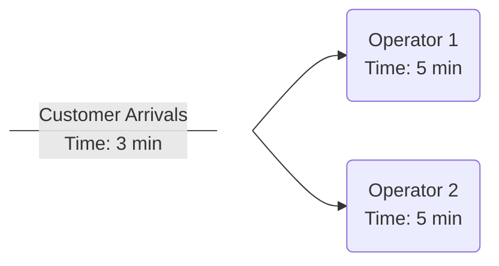
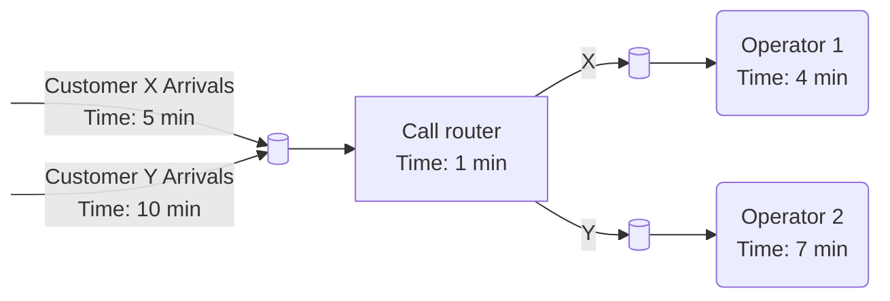
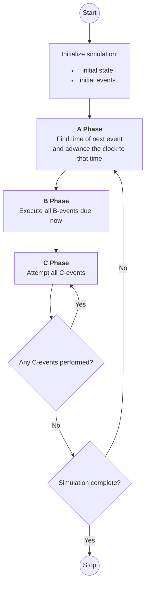

# Modeling Time in Simulation Systems

There are a number of means for modeling the progress of time. Two specific approaches are
described here:
- The _time-slicing method_ is described shortly since it is useful for understanding the basics of the simulation approach
- _Discrete-event simulation_: is the method we are using, and it is the method that
underlies the commercial simulation software
- There exists also a _continuous simulation_, which is sometimes used for modelling operations systems

## Time-slice method

The simplest method for modeling the progress of time is the time-slicing approach in
which a constant time-step ($\Delta t$) is adopted. This is best explained with an example. In a
telephone call center, calls arrive every 3 minutes and are passed to one of two operators
who take 5 minutes to deal with the customer (figure below). It is assumed for now that there
is no variation in the inter-arrival time and the service time.


The table below shows the first 24 minutes of simulation of the call center with $\Delta t$ set to 1 minute.
Column two (Call Arrival) shows the time remaining until a call arrives. Columns three (Operator 1) and four (Operator 2) show the time remaining until a customer service is complete. The number of calls completed by each operator is calculated.

| Time | Call Arrival   | Operator 1   | Operator 2   |                                                  |
|------|----------------|--------------|--------------|--------------------------------------------------|
| 0    | 3              |              |              |                                                  |
| 1    | 2              |              |              |                                                  |
| 2    | 1              |              |              |                                                  |
| 3    | 3              | 5            |              | First call received, Operator service 1 starts   |
| 4    | 2              | 4            |              |                                                  |
| 5    | 1              | 3            |              |                                                  |
| 6    | 3              | 2            | 5            | Second call received, Operator service 2 starts  |
| 7    | 2              | 1            | 4            |                                                  |
| 8    | 1              |              | 3            | First call served                                |
| 9    | 3              | 5            | 2            | Third call received, Operator service 1 starts   |
| 10   | 2              | 4            | 1            |                                                  |
| 11   | 1              | 3            |              | Second call served                               |
| 12   | 3              | 2            | 5            | Fourth call received, Operator service 2 starts  |
| 13   | 2              | 1            | 4            |                                                  |
| 14   | 1              |              | 3            | Third call served                                |
| 15   | 3              | 5            | 2            | Fifth call received, Operator service 1 starts   |
| 16   | 2              | 4            | 1            |                                                  |
| 17   | 1              | 3            |              | Fourth call served                               |
| 18   | 3              | 2            | 5            | Sixth call received, Operator service 2 starts   |
| 19   | 2              | 1            | 4            |                                                  |
| 20   | 1              |              | 3            | Fifth call served                                |
| 21   | 3              | 5            | 2            | Seventh call received, Operator service 1 starts |
| 22   | 2              | 4            | 1            |                                                  |
| 23   | 1              | 3            |              | Sixth call served                                |
| 24   | 3              | 2            | 5            | Eighth call received, Operator service 2 starts  |
|------| -------------- | ------------ | ------------ | ------------------------------------------------ |
| Completed<br>calls|                | 3            | 3            |                                                  |

It is relatively simple to set up a time-slicing simulation for this situation, look [this](1.2_Time_Slice_Simulator.md). The same
approach could be used for more complex situations, although the table would soon become
huge and possibly unmanageable by hand. By devising a flow chart outlining the
sequence of activities, it would be possible to develop a computer program to perform the
simulation, making larger-scale simulations possible. The time-slicing approach can also be
modeled easily in a spreadsheet.

There are two main problems with the time-slicing approach. First, it is very inefficient.
During many of the time-steps there is no change in the system-state, and as a result, many
computations are unnecessary. In the previous table, the only points of interest are when a call
arrives when an operator takes a call and when an operator completes a call. In total, there
are 22 such points as opposed to the 72 (24×3) calculations performed in the table. This
problem is only likely to be exacerbated the larger the simulation becomes.

## Discrete Event Simulation

In discrete-event simulation, only the points in time at which the states of the system changes are represented. In other words, the system is modeled as a series of events, that is, instants in time when a state-change occurs. Examples of events are a customer arrives, a customer starts receiving service and a machine is repaired. Each of these occurs at an instant in time. To illustrate this point, the call center simulation is summarized as a discrete-event simulation in the following table.

| Time | Event                                       |
|------|---------------------------------------------|
| 3    | Customer arrives, Operator 1 starts service |
| 6    | Customer arrives, Operator 2 starts service |
| 8    | Operator 1 completes service                |
| 9    | Customer arrives, Operator 1 starts service |
| 11   | Operator 2 completes service                |
| 12   | Customer arrives, Operator 2 starts service |
| 14   | Operator 1 completes service                |
| 15   | Customer arrives, Operator 1 starts service |
| 17   | Operator 2 completes service                |
| 18   | Customer arrives, Operator 2 starts service |
| 20   | Operator 1 completes service                |
| 21   | Customer arrives, Operator 1 starts service |
| 23   | Operator 2 completes service                |
| 24   | Customer arrives, Operator 2 starts service |

The above table has been created by simply identifying the events in the previous table. This obviously requires a time-slicing simulation to be carried out first. It is normal, however, to perform the discrete-event simulation directly. A number of mechanisms have been proposed for carrying out discrete-event simulation, among them are the event-based, activity-based, process-based and three-phase approaches. We use three-phase method here in this course. This approach is used by a number of commercial simulation software packages, but this is not to say that the other mechanisms are not in common use within commercial software as well. From the software user’s perspective, however, the specifics of the underlying simulation method are generally hidden.

## Three-phase simulation

In the three-phase simulation approach events are classified into two types.
- _B (bound or booked) events_: these are state changes that are scheduled to occur at a point in time. For instance, the call arrivals in the call centre model occur every 3 minutes. Once a call has been taken by an operator, it can be scheduled to finish 5 minutes later. This principle applies even when there is variability in the model, by predicting in advance how long a particular activity will take. In general B-events relate to arrivals or the completion of an activity.
- _C (conditional) events_: these are state changes that are dependent on the conditions in the model. For instance, an operator can only start serving a customer if there is a customer waiting to be served and the operator is not busy. In general C-events relate to the start of some activity.

In order to demonstrate the three-phase approach, a slightly more complex call center example is now introduced (figure below). Two types of customer (X and Y) make calls to the centre. Calls arrive from a customer type X every 5 minutes and from a customer type Y every 10 minutes. Arriving calls are placed in a queue (denoted by a database symbol) before the call router (e.g., a touch tone menu system) directs the call to the right operator; an activity that takes 1 minute. There are two operators; the first takes all customer X calls, the second all customer Y calls. Operator 1 takes exactly 4 minutes to deal with a call and operator 2 exactly 7 minutes.


As a first step, all the B and C events for the system need to be defined. These are shown in the following two tables. Note the column that specifies which events are to be scheduled following an event, for instance, the arrival of a customer type X leads to the next arrival being scheduled (event B1), e.q., new customer arrival to be generated. Since each C-event represents the start of an activity, they schedule the B-event that represents the completion of that activity. For events B4 and B5 the calls are output to the (outside) ‘‘world’’. This term means that the calls are passed out of the model. Also note that for event B4 and B5 statistics are collected on the number of customers served. For each C-event the conditions for it to be executed are specified.

| Event | Type            | Change in state                            | Future events to schedule |
|-------|-----------------|--------------------------------------------|-------------------------|
| B1    | Arrival         | Customer X arrives and enters router queue | B1                      |
| B2    | Arrival         | Customer Y arrives and enters router queue | B2                      |
| B3    | Finish activity | Router completes work and outputs X to operator 1 queue,<br>Y to operator 2 queue |  |
| B4    | Finish activity | Operator 1 completes work and outputs to world<br>(increment result work complete X by 1) | |
| B5    | Finish activity | Operator 2 completes work and outputs to world<br>(increment result work complete Y by 1)| |


| Event | Type | Condition                                             | Change in state | Future events to schedule |
|-------|------|-------------------------------------------------------|-----------------|---------------------------|
| C1 | Start activity | Call in router queue and<br>router is idle            | Router takes call from<br>router queue and starts work | B3                        |
| C2 | Start activity | Call is in operator 1 queue<br>and operator 1 is idle | Operator 1 takes call<br> from operator 1 queue and starts work | B4                        |
| C3 | Start activity | Call is in operator 2 queue<br>and operator 2 is idle | Operator 2 takes call<br>from operator 2 queue and starts work| B5                        |

Having identified all the events, the system can be simulated. The following figure outlines the three-phase approach. At the start of the simulation, the initial state of the model is determined. This may involve placing work-in-progress in the model to create a realistic initial condition. The initial B-events are also scheduled, for instance, the arrival of the first customers. Scheduled events are placed into an event list that keeps a record of all future events that have been scheduled. The simulation then moves into three phases that are continuously repeated.

In the A-phase, which is also known as the simulation executive, the time of the next event is determined by inspecting the event list. The simulation clock is then advanced to the time of the next event. In the B-phase, all B-events due at the clock time are executed. In the C-phase all C-events are attempted and those for which the conditions are met are executed. Since the successful execution of a C-event may mean that another C-event can now be executed, the simulation continues to attempt C-events until no further events can be executed. The simulation then returns to the A-phase unless it is deemed that the simulation is complete. Typically, a simulation is run for a predetermined run-length or possibly a set number of arrivals.


### Telephone call centre example: hand simulation

A computer can easily be programmed to follow the stages in the three-phase approach. For the purpose of understanding, however, it is useful to perform a simulation by hand. The following table shows the initial state of the simulation. It is assumed that there are no calls in the call centre, although some calls could be placed in the queues if it were seen as necessary.

**Call Centre Simulation: Clock 0 (Initialize simulation)**

Two initial events B1 and B2 are scheduled for the arrival of the first customers X and Y. Event list is maintained in a chronological sequence so the A-phase can simply pick the event at the top of the list.

| Phase | Router Queue | Router | Oper 1 queue | Oper 1 | Oper 2 queue | Oper 2 |
|-------|--------------|--------|--------------|--------|--------------|--------|
| | Empty | Idle | Empty | Idle | Empty | Idle |

Event List:

| Event | Time |
|-------|------|
| B1    | 5    |
| B2    | 10   |

Results (how many X and Y calls processed):

| Work<br>complete |   |
|------------------|---|
| X                | 0 |
| Y                | 0 |


Two initial events are scheduled for the arrival of the first customers X and Y, which will occur at time 5 minutes and 10 minutes respectively. Note that the event list is placed in a chronological sequence so the A-phase can simply pick the event at the top of the list. The simulation then enters the A-phase which advances the clock to time 5 minutes when the first B-event, B1, is due (the following table). In the B-phase, the call from the first customer type X arrives (X1) at the router queue.

**Call Centre Simulation: Clock 5 (Event B1)**

A-phase picks the first event from the list (Event list) and advances the clock to time 5 minutes (time for the first B1 event in the Event list). Then the simulator jumps to the B-phase.

In the B-phase, the call from the first customer type X arrives (X1) at the router queue. Also, the next arrival of a customer type X call is scheduled to occur at time 10 (event B1), and it is placed to the event list after the existing events at the same time (event B2 at time 10). After that, we have processed all pending B-events at the current time (5 minutes). Then it is time for the simulator to jump to the C-phase.

In the C-phase, event C1 conditions (event in the router) are true, and event C1 is executed. Call X1 is moved to the router and the router is scheduled to complete after 1 minute, i.e., at time 6 minutes (event B3). No other C-events can be executed. After that, the simulator returns to the A-phase.

| Phase | Router Queue | Router | Oper 1 queue | Oper 1 | Oper 2 queue | Oper 2 |
|-------|-------------|--------|--------------|--------|--------------|--------|
| B     | X1          | Idle   | Empty        | Idle   | Empty        | Idle   |
| C     | Empty       | X1     | Empty        | Idle   | Empty        | Idle   |

Event List:

| Event | Time |
|-------|------|
| B3    | 6    |
| B2    | 10   |
| B1    | 10   |

Results:

| Work<br>complete |   |
|------------------|---|
| X                | 0 |
| Y                | 0 |

**Call Centre Simulation: Clock 6 (Event B3)**

We are in the A-phase, and the first event on the event list is at 6 minutes, the clock is then advanced to time 6 minutes and the simulator jumps to the B-state.

In the B-state, event B3 is executed in the B-phase. As a result, call X1 is transferred to the operator 1 queue. No other B-events are available, therefore, the simulator goes to the C-phase.

In the C-phase, event C2 conditions are met, i.e., the call is transferred to operator 1, who is scheduled to complete the call at time 10 via event B4 which is added to the event list. No other C-events can be executed. After that, the simulator returns to the A-phase.

| Phase | Router Queue | Router | Oper 1 queue | Oper 1 | Oper 2 queue | Oper 2 |
|-------|--------------|--------|--------------|--------|--------------|--------|
| B     | Empty        | Idle   | X1           | Idle   | Empty        | Idle   |
| C     | Empty        | Idle   | Empty        | X1     | Empty        | Idle   |

Event List:

| Event | Time |
|-------|------|
| B2    | 10   |
| B1    | 10   |
| B4    | 10   |


Results:

| Work<br>complete |   |
|------------------|---|
| X                | 0 |
| Y                | 0 |

**Call Centre Simulation: Clock 10 (Events B2,B1,B4)**

We are in the A-phase, and the first event on the event list is at 10 minutes, the clock is then advanced to time 10 minutes and the simulator jumps to the B-state.

In the B-state, three B-events are executed, B2, B1 and B4 respectively. As a result of their ordering, call Y1 is selected to enter the router queue before call X2, the second call from customer X (on the Router Queue column at the following table, entries first taken out are on the right side of the row). Here a first-in-first-out priority is used, but other priorities are also possible (answer customer X calls before customer Y calls). The two arrival events (B2 and B1) lead to further arrival events being scheduled, B1 at 15 minutes (10 + 5), and B2 at 20 minutes (10 + 10). When B4 is executed, call X1 leaves the model (it has been processed), and the work complete count is incremented by 1. All B-events are now processed, the simulator goes to the C-phase.

In the C-phase, event C1 is executed making call Y1 move to the router and scheduling event B3 at time 11 minutes (10 + 1). No further C-events can be executed, and the simulator returns to the A-phase.

| Phase | Router Queue | Router | Oper 1 queue | Oper 1 | Oper 2 queue | Oper 2 |
|-------|--------------|--------|--------------|--------|--------------|--------|
| B     | X2,Y1        | Idle   | Empty        | Idle   | Empty        | Idle   |
| C     | X2           | Y1     | Empty        | Idle   | Empty        | Idle   |

Event List:

| Event | Time |
|-------|------|
| B3    | 11   |
| B1    | 15   |
| B2    | 20   |

Results:

| Work<br>complete |   |
|------------------|---|
| X                | 1 |
| Y                | 0 |


**Call Centre Simulation: Clock 11 (Event B3)**

In the A-phase, the clock is advanced to 11 minutes and the simulator jumps to the B-phase. Event B3 is processed and the router gives call Y1 to the operator 2 queue. There are no more events, the simulator then jumps to C-phase. C1 event conditions are true, B3 event is scheduled at time 12 minutes (11 + 1). C3 event conditions are also true, therefore event B5 is inserted to the event list at time 18 minutes (11 + 7).

The simulation then continues in a similar manner through the tree phases.

| Phase | Router Queue | Router | Oper 1 queue | Oper 1 | Oper 2 queue | Oper 2 |
|-------|--------------|--------|--------------|--------|--------------|--------|
| B     | X2           | Idle   | Empty        | Idle   | Y1           | Idle   |
| C     | Empty        | X2     | Empty        | Idle   | Empty        | Y1     |

Event List:

| Event | Time |
|-------|------|
| B3    | 12   |
| B1    | 15   |
| B5    | 18   |
| B2    | 20   |

Results:

| Work<br>complete |   |
|------------------|---|
| X                | 1 |
| Y                | 0 |


**Call Centre Simulation: Clock 12 (Event B3)**

| Phase | Router Queue | Router | Oper 1 queue | Oper 1 | Oper 2 queue | Oper 2 |
|-------|--------------|--------|--------------|--------|--------------|--------|
| B     | Empty        | Idle   | X2           | Idle   | Empty        | Y1     |
| C     | Empty        | Idle   | Empty        | X2     | Empty        | Y1     |

Event List:

| Event | Time |
|-------|------|
| B1    | 15   |
| B4    | 16   |
| B5    | 18   |
| B2    | 20   |

Results:

| Work<br>complete |   |
|------------------|---|
| X                | 1 |
| Y                | 0 |


**Call Centre Simulation: Clock 15 (Event B1)**

| Phase | Router Queue | Router | Oper 1 queue | Oper 1 | Oper 2 queue | Oper 2 |
|-------|--------------|--------|--------------|--------|--------------|--------|
| B     | X3           | Idle   | Empty        | X2     | Empty        | Y1     |
| C     | Empty        | X3     | Empty        | X2     | Empty        | Y1     |

Event List:

| Event | Time |
|-------|------|
| B4    | 16   |
| B3    | 16   |
| B5    | 18   |
| B1    | 20   |
| B2    | 20   |

Results:

| Work<br>complete |   |
|------------------|---|
| X                | 1 |
| Y                | 0 |


## Continuous time simulation

In a whole range of situations, operations are not subject to discrete changes in state, but the state of the system changes continuously through time. The most obvious of these is in operations involving the movement of fluids, for instance, chemical plants and oil refineries.
In these systems, tanks of fluid are subject to continuously changing volumes. Systems that involve a high volume of fast moving items may also be thought of as continuous, for instance, food manufacturing plants and communications systems. In these situations, the level of granularity with which the system is to be analyzed determines whether it is seen as discrete or continuous.

Digital computers cannot model continuous changes in state. Therefore, the continuous simulation approach approximates continuous change by taking small discrete time-steps ($\Delta t$). The smaller the time-step, the more accurate the approximation, but the slower the simulation runs, because more samples are being recalculated more frequently per simulated time unit. This approach is, of course, the same as the time-slicing method described above.

Continuous simulation is widely used in, for instance, engineering, economics and biology. In general, discrete-event simulation is more appropriate when a system needs to be modeled in detail, particularly when individual items need to be tracked through the system.

# Modeling Variability in Simulation Systems

Having described the modelling of the progress of time, the attention now turns to the second aspect that is central to simulation, modelling variability. In this respect, the modelling of unpredictable variability presents the key challenge and we will discuss this in the [next section](1.3_Probability_Distributions.md). There is, however, a brief discussion on the modelling of predictable variability at the next paragraph.

## Modelling unpredictable variability

So far the call centre simulation has not included any elements of variability and, in particular, unpredictable variability. It is unrealistic to expect the time callers spend at the router and the operators to be fixed. Nor will calls arrive at fixed intervals with exactly two X customers for every Y. How can such unpredictable variability be represented within a simulation?

To answer this question, first take the example of the ratio of X and Y customers. Rather than model the arrival of these customers as separate events, it is common practice to model a single arrival event and to determine the call type as a customer arrives. If there were many customer types, this negates the need for a large number of B-events; one for each customer type. For now we will assume that a customer arrives every 3 minutes exactly.

A simple way of determining the call type would be to toss a coin every time a customer arrives in the model. A head could represent an X customer and a tail a Y customer. The shortcoming of this approach is that it assumes an equal proportion of X and Y customers (unless the coin is biased). What if 60% of customers are of type X and only 40% of type Y? This could be represented by taking 10 pieces of paper and writing X on six of them and Y on four. The pieces of paper could then be placed into a hat, and every time a customer arrives in the model a piece of paper could be drawn out to determine the customer type. It is important that the paper is replaced each time to maintain the ratio of customers at 60:40.

Although the second approach would enable different customer ratios to be modeled, it is only suitable for hand simulations; a computer cannot draw pieces of paper from a hat! In computer simulation, a similar principle is adopted based upon the use of random numbers.

## Orientation tasks 2 (Assignments, each task 2p)

W=writing task, P=programming task

1. (W) a) Why does an arrival event need to generate a new arrival event?
   b) Which event should be generated by the start of the service (of a single servicepoint)?

2. (P) Define the `Event` and `EventList` classes so that the `EventList` can be used to get the `Event` objects processed in the correct chronological order. The `Event` is associated with an event time as an essential piece of information, and it is **essential** that the next event in the event list can be retrieved on demand.

   To implement the list, you can use the `PriorityQueue` class so that the `EventList` contains a `PriorityQueue`. To implement the ordering, `Events` must implement the Comparable interface, see below.

   Make a test program to a) generate a list of events, b) remove the first (=next to be processed) event from the list, and c) print the contents of the `EventList`, ordered by event time.

   As a tip for c: The API description says that Java's for-iteration does not print the contents of the `PriorityQueueue` in any particular order, but you have to find a way other than for-iteration.
3. (P) Define the event type using Java's own enum definition:
   public enum EventType {...}. Learn enum from the following source, for example: https://docs.oracle.com/javase/tutorial/java/javaOO/enum.html

   Add the event type to the `Event`-objects of the previous task. Initially, there can be, say, 2 types (arrival, exit).  The event types are indicated when the event list is printed.
4. (W) Continue with the three-phase simulation example (section Telephone call centre example: hand simulation) until one client of client type Y exits the system. Return your solution as an attachment to the solution of this exercise.

### An example of the `Comparable` interface

In order to sort the `Student` class below by age, you need to know what the sorting criterion is. This is done by implementing the `Comparable` interface and the `compareTo` method required to implement it (see Java API):
```Java
public class Student implements Comparable<Student> {

private String name;
	private int age;  

	public Student(String name,int age) {  
		this.name = name;  
		this.age=age;  
	}  
  
	public int compareTo(Student st) {  
		if (age==st.age) 
			return 0;
        else if (age>st.age)  
			return 1;  
		else  
			return -1;  
	}
	
	public String toString() {
		return name;
	}
}
```
When implementations of the `Comparable` interface are exported to a collection that maintains the order, it is based on the `compareTo` method.

Note: For example, `String` and `Integer` classes already implement the `Comparable` interface.

The simplest implementation of `compareTo` above could be as follows:
```Java
public int compareTo(Student st) {  
	return age-st.age;
}
```
According to API, the return value is:
> a negative integer, zero, or a positive integer as this object is less than, equal to, or greater than the specified object.
