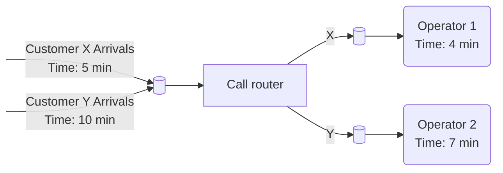

# Modeling Time in Simulation Systems

There are a number of means for modelling the progress of time. Two specific approaches are
described here:
- The _time-slicing method_ is described shortly since it is useful for understanding the basics of the simulation approach
- _Discrete-event simulation_: is the method we are useing, and it is the method that
underlies the commercial simulation software
- There exists also a _continuous simulation_, which is sometimes used for modelling operations systems.

## Time-slice method

The simplest method for modelling the progress of time is the time-slicing approach in
which a constant time-step ($\delta t$) is adopted. This is best explained with an example. In a
telephone call centre, calls arrive every 3 minutes and are passed to one of two operators
who take 5 minutes to deal with the customer (Figure below). It is assumed for now that there
is no variation in the inter-arrival time and the service time.

Table below shows 24 minutes of simulation of the call centre with $\delta t$ set to 1 minute.
Column two (Call Arrival) shows the time remaining until a call arrives. Columns three (Operator 1) and four (Operator 2) show the time remaining until a customer service is complete. The number of calls completed by each operator is calculated.

| Time | Call Arrival   | Operator 1   | Operator 2   |                                                  |
|------|----------------|--------------|--------------|--------------------------------------------------|
| 0    | 3              |              |              |                                                  |
| 1    | 2              |              |              |                                                  |
| 2    | 1              |              |              |                                                  |
| 3    | 3              | 5            |              | First call received, Operator service 1 starts   |
| 4    | 2              | 4            |              |                                                  |
| 5    | 1              | 3            |              |                                                  |
| 6    | 3              | 2            | 5            | Second call received, Operator service 2 starts  |
| 7    | 2              | 1            | 4            |                                                  |
| 8    | 1              |              | 3            | First call served                                |
| 9    | 3              | 5            | 2            | Third call received, Operator service 1 starts   |
| 10   | 2              | 4            | 1            |                                                  |
| 11   | 1              | 3            |              | Second call served                               |
| 12   | 3              | 2            | 5            | Fourth call received, Operator service 2 starts  |
| 13   | 2              | 1            | 4            |                                                  |
| 14   | 1              |              | 3            | Third call served                                |
| 15   | 3              | 5            | 2            | Fifth call received, Operator service 1 starts   |
| 16   | 2              | 4            | 1            |                                                  |
| 17   | 1              | 3            |              | Fourth call served                               |
| 18   | 3              | 2            | 5            | Sixth call received, Operator service 2 starts   |
| 19   | 2              | 1            | 4            |                                                  |
| 20   | 1              |              | 3            | Fifth call served                                |
| 21   | 3              | 5            | 2            | Seventh call received, Operator service 1 starts |
| 22   | 2              | 4            | 1            |                                                  |
| 23   | 1              | 3            |              |                                                  |
| 24   | 3              | 2            | 5            | Eighth call received, Operator service 2 starts  |
|------| -------------- | ------------ | ------------ | ------------------------------------------------ |
| Completed calls|                | 3            | 3            |                                     |

It is relatively simple to set up a time-slicing simulation for this situation. The same
approach could be used for more complex situations, although the table would soon become
very large and possibly unmanageable by hand. By devising a flow chart outlining the
sequence of activities it would be possible to develop a computer program to perform the
simulation, making larger-scale simulations possible. The time-slicing approach can also be
modelled easily in a spreadsheet.
There are two main problems with the time-slicing approach. First, it is very inefficient.
During many of the time-steps there is no change in the system-state and as a result many
computations are unnecessary. In the previous Table the only points of interest are when a call
arrives, when an operator takes a call and when an operator completes a call. In total there
are 22 such points as opposed to the 72 (24×3) calculations performed in the Table. This
problem is only likely to be exacerbated the larger the simulation becomes.

## Discrete Event Simulation

In discrete-event simulation only the points in time at which the state of the system changes are represented. In other words the system is modelled as a series of events, that is, instants in time when a state-change occurs. Examples of events are a customer arrives, a customer starts receiving service and a machine is repaired. Each of these occurs at an instant in time. To illustrate this point, the call centre simulation is summarized as a discrete-event simulation in the following Table.

| Time | Event                                       |
|------|---------------------------------------------|
| 3    | Customer arrives, Operator 1 starts service |
| 6    | Customer arrives, Operator 2 starts service |
| 8    | Operator 1 completes service                |
| 9    | Customer arrives, Operator 1 starts service |
| 11   | Operator 2 completes service                |
| 12   | Customer arrives, Operator 2 starts service |
| 14   | Operator 1 completes service                |
| 15   | Customer arrives, Operator 1 starts service |
| 17   | Operator 2 completes service                |
| 18   | Customer arrives, Operator 2 starts service |
| 20   | Operator 1 completes service                |
| 21   | Customer arrives, Operator 1 starts service |
| 23   | Operator 2 completes service                |
| 24   | Customer arrives, Operator 2 starts service |

The above Table has been created by simply identifying the events in the previous Table. This obviously requires a time-slicing simulation to be carried out first. It is normal, however, to perform the discrete-event simulation directly. A number of mechanisms have been proposed for carrying out discrete-event simulation, among them are the event-based, activity-based, process-based and three-phase approaches. We use three-phase method here in this course. This approach is used by a number of commercial simulation software packages, but this is not to say that the other mechanisms are not in common use within commercial software as well. From the software user’s perspective, however, the specifics of the underlying simulation method are generally hidden.

## Three-phase simulation

In the three-phase simulation approach events are classified into two types.
- _B (bound or booked) events_: these are state changes that are scheduled to occur at a point in time. For instance, the call arrivals in the call centre model occur every 3 minutes. Once a call has been taken by an operator, it can be scheduled to finish 5 minutes later. This principle applies even when there is variability in the model, by predicting in advance how long a particular activity will take. In general B-events relate to arrivals or the completion of an activity.
- _C (conditional) events_: these are state changes that are dependent on the conditions in the model. For instance, an operator can only start serving a customer if there is a customer waiting to be served and the operator is not busy. In general C-events relate to the start of some activity.

In order to demonstrate the three-phase approach a slightly more complex call centre example is now introduced (Figure below). Two types of customer (X, Y) make calls to the centre. Calls arrive from a customer type X every 5 minutes and from a customer type Y every 10 minutes. Arriving calls are placed in a queue (denoted by a circle) before the call router (a touch tone menu system) directs the call to the right operator; an activity that takes 1 minute. There are two operators, the first takes all customer X calls, the second all customer Y calls. Operator 1 takes exactly 4 minutes to deal with a call and operator 2 exactly 7 minutes.

| Event | Type            | Change in state                            | Future events to schedule |
|-------|-----------------|--------------------------------------------|-------------------------|
| B1    | Arrival         | Customer X arrives and enters router queue | B1                      |
| B2    | Arrival         | Customer Y arrives and enters router queue | B2                      |
| B3    | Finish activity | Router completes work and outputs X to operator 1 queue, Y to operator 2 queue |  |
| B4    | Finish activity | Operator 1 completes work and outputs to world (increment result work complete X by 1) | |
| B5    | Finish activity | Operator 2 completes work and outputs to world (increment result work complete Y by 1)| |

| Event | Type | Condition | Change in state | Future events to schedule |
|-------|------|-----------|-----------------|---------------------------|
| C1 | Start activity | Call in router queue and router is idle| Router takes call from router queue and starts work | B3                        |
| C2 | Start activity | Call is in operator 1 queue and operator 1 is idle | Operator 1 takes call  from operator 1 queue and starts work | B4                        |
| C3 | Start activity | Call is in operator 2 queue and operator 1 is idle | Operator 2 takes call from operator 2 queue and starts work| B5                        |

## Continuous time simulation

# Modeling Variability in Simulation Systems

## Random Numbers

### Random Numbers in Java

<!-- http://akira.ruc.dk/~keld/research/JAVASIMULATION/JAVASIMULATION-1.1/packages/javaSimulation/Docs/javasimulation.random.html -->
<!-- http://akira.ruc.dk/~keld/teaching/DAT_C_e01/Opgavekode/javaSimulation/random/src/Random.java -->