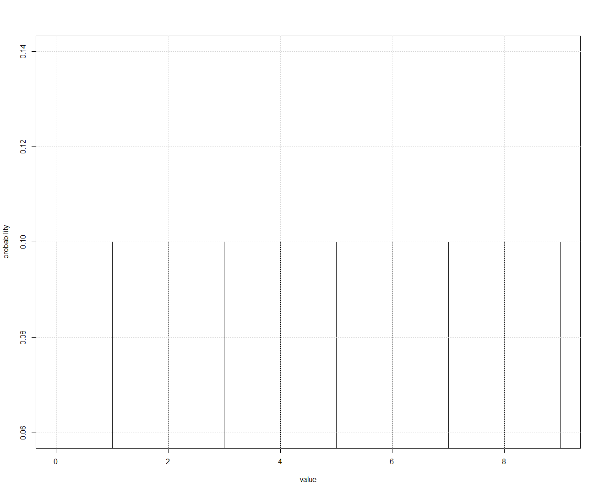
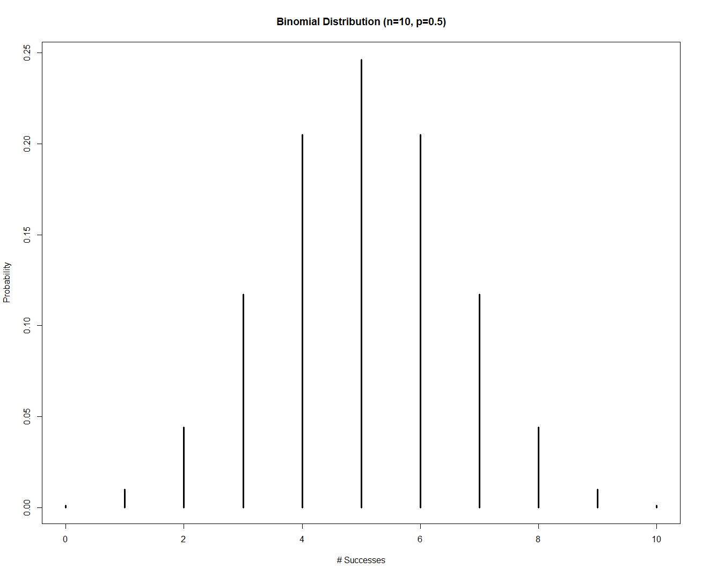
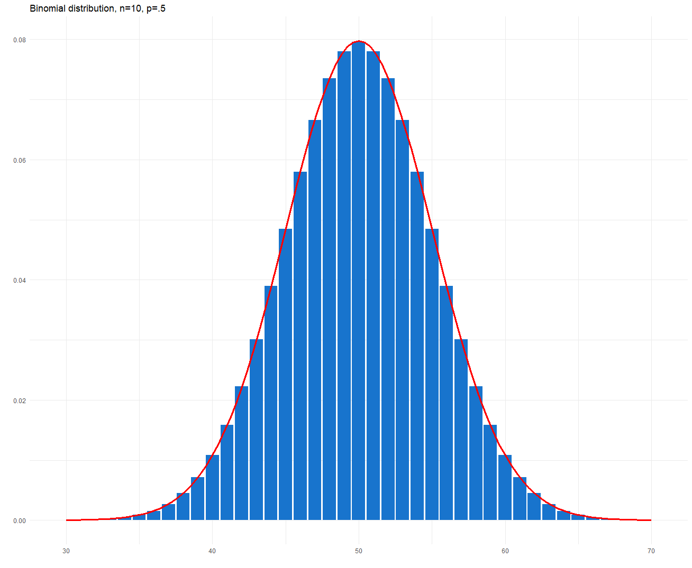
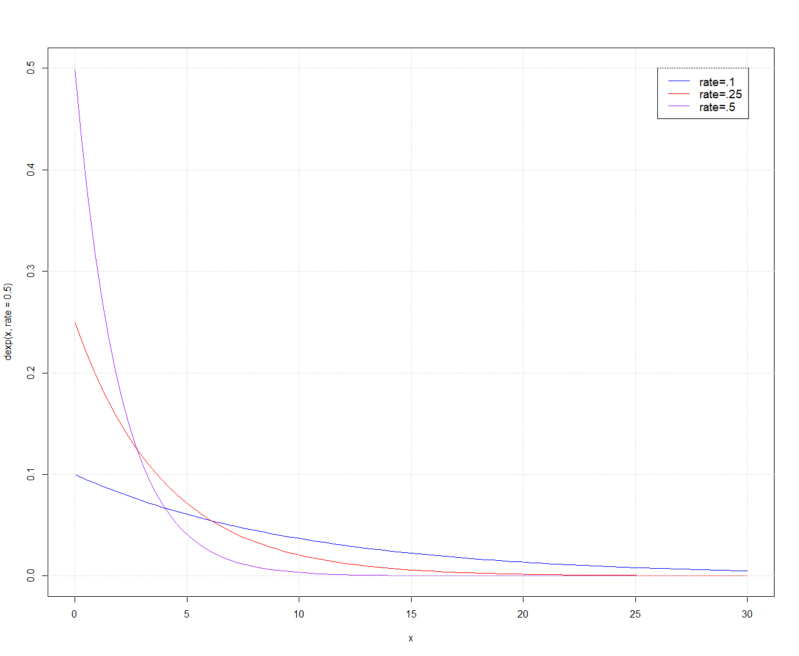
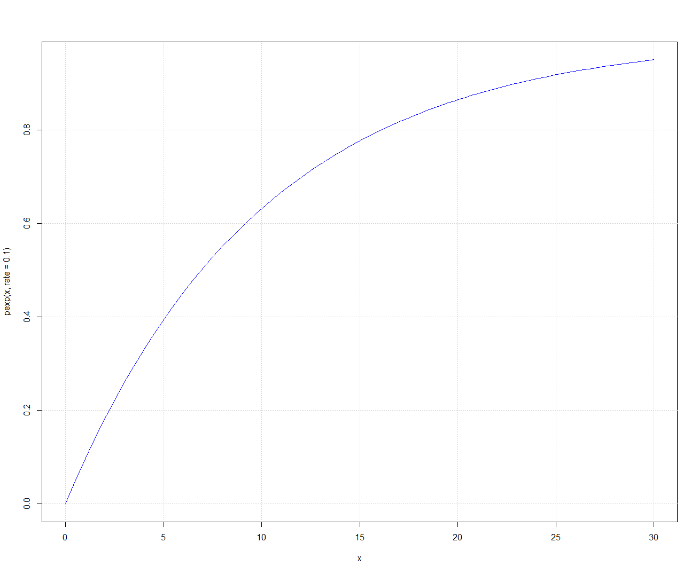

# Random Numbers

## Introduction to Random Numbers

Random numbers are values that lack any discernible pattern or predictability, appearing as if they were generated by chance. They are used to introduce uncertainty and variability into simulations, experiments, and applications where true randomness is desired.

There are two primary types of random numbers:
1. **Pseudo-Random Numbers:**
    - Pseudo-random numbers are generated using algorithms or mathematical formulas. They are deterministic and will produce the same sequence given the same initial conditions (seed).
    - These numbers are widely used in computer programs and simulations for their efficiency and repeatability. Common algorithms include the [Linear Congruential Generator (LCG)](https://en.wikipedia.org/wiki/Linear_congruential_generator) and the [Mersenne Twister](https://en.wikipedia.org/wiki/Mersenne_Twister).
2. **True Random Numbers:**
    - True random numbers are generated from inherently unpredictable physical processes or phenomena, such as radioactive decay or atmospheric noise. They are genuinely random and not generated by any algorithm.
    - True random number generators (TRNGs) are used in applications requiring a high degree of unpredictability and security, such as cryptography.
    - Intel microprosessors have special hardware and a special machine instruction, [RDRAND](https://en.wikipedia.org/wiki/RDRAND), for generating true random numbers

Random numbers enable the introduction of uncertainty and variability into models.

## Probability

[Probability](https://en.wikipedia.org/wiki/Probability) is a mathematical concept that deals with the likelihood of an event occurring. It is widely used in various fields such as statistics, mathematics, economics, and science to make predictions and decisions based on uncertain outcomes. In simple terms, probability measures the chances or the likelihood of the occurrence of an event. It is expressed as a number between 0 and 1, where 0 represents an impossible event and 1 represents a certain event. The higher the probability of an event, the more likely it is that the event will occur.

## Properties of Random Numbers

Random numbers, whether generated pseudorandomly or truly randomly, need to have two key properties:
- **Uniform Distribution:** Ideally, random numbers are uniformly distributed, meaning that each possible value has an equal probability of being selected. This property ensures fairness and unbiased randomness.
- **Independence:** Each random number is independent of all previous and future numbers in the sequence. The occurrence of one number does not affect the likelihood of any other number appearing.

Let's generate integer random numbers between 0 and 9. The probability of getting a specific number is 1/10, and this holds true for every value in range [0, 9]. This can be shown in the picture below:

> In this section, all graphical pictures are done using [R language](https://cran.r-project.org/). R is a language and environment for statistical computing and graphics.

This kind of picture which shows the probabilty against possible values is called as [probability density function](https://online.stat.psu.edu/stat414/lesson/14/14.1) (PDF). It can be interpreted as providing a relative likelihood that the value of the random number generated would be equal to that value. As we can see from the picture, every possible value has equal probability to be generated—they are uniformly distributed. If we add the probabilities of different integer values between 0 and 9 together, i.e., 0.1+0.1+0.1+0.1+0.1+0.1+0.1+0.1+0.1+0.1, we get 10*0.1=1 which means that the probability to get any number in range [0, 9] is 1. That is, it is for sure that we get a number between 0 and 9.

## Probability distributions

Many processes in Nature do not follow uniform distribution. For example, the distribution of random observations (e.g., temperature measurements) for many experiments follows normal distribution. On the other hand, the number of phone calls received at a call center during a fixed time period is Poisson distributed. Therefore, probability distribution is a fundamental concept in statistics and probability theory that provides a framework for understanding and modeling uncertainty and randomness in various phenomena. It describes the likelihood of different outcomes or events occurring in a random experiment or process. In other words, it defines how the possible values of a random variable are spread or distributed.

Probability distributions can be categorized into two main types:
- **Discrete Probability Distribution**: In this type, the random variable can only assume distinct, separate values. Examples include the Bernoulli distribution, binomial distribution, and Poisson distribution.
- **Continuous Probability Distribution**: In this type, the random variable can take on any value within a range. Common continuous distributions include the normal distribution, exponential distribution, and uniform distribution.

Some common probability distributions include:
- **Normal Distribution**: Often called the bell curve, it is used to model many natural phenomena and is central to statistical inference.
- **Binomial Distribution**: It is generally applied to experiments in which the result is one of a small number of possible final states, such as the number of "heads" or "tails" in a series of coin tosses. Used to model the number of successes in a fixed number of independent [Bernoulli trials](https://en.wikipedia.org/wiki/Bernoulli_trial).
- **Exponential Distribution**: Models the time between events in a [Poisson process](https://builtin.com/data-science/poisson-process), such as the time between customer arrivals at a service center.
- **Poisson Distribution**: Describes the number of events occurring in fixed intervals of time or space when events are rare and random.

The Poisson distribution focuses on counting the number of discrete events within a fixed interval, while the exponential distribution deals with the continuous time intervals between events occurring at a constant average rate. They are closely related, as the Poisson process describes the number of events, and the exponential distribution describes the time between these events.

### Example of binomial distribution, Coin Flips

Suppose you are flipping a fair coin, which has two possible outcomes: "Heads" (H) and "Tails" (T). You are interested in finding out how many times you will get "Heads" when you flip the coin 10 times.

In this scenario, each coin flip can be considered a Bernoulli trial with two possible outcomes: "Heads" (success) with a probability of 0.5 and "Tails" (failure) with a probability of 0.5.

The binomial distribution can be used to model the number of "Heads" (successes) you will get in 10 coin flips. Let's denote:
- $n$ = 10 (the number of trials or coin flips)
- $p$ = 0.5 (the probability of success on each trial, which is getting "Heads" in this case)

Now, we want to find the probability of getting a specific number of "Heads" ($k$) in 10 coin flips. The probability mass function (PMF) of the binomial distribution allows us to calculate this:
$$P(X=k)={n\choose k}\cdot p^kq^{n-k}$$
Where:
- $P(X=k)$ is the probability of getting exactly $k$ "heads" in 10 coin flips
- ${n\choose k}$ represents the [binomial coefficient](https://en.wikipedia.org/wiki/Binomial_coefficient), which is the number of ways to choose $k$ successes out of $n$ trials. It's calculated as $C(n, k) = n! / (k! \cdot (n-k)!)$
- $p^k$ is the probability of $k$ successes (getting "Heads" $k$ times).
- $(1-p)^{(n-k)}$ is the probability of $(n-k)$ failures (getting "Tails" $(n-k)$ times).

Let's calculate a specific probability from this example:
Probability of getting exactly 5 "Heads" ($k$ = 5) in 10 coin flips:
$$P(X = 5) = {10\choose 5} \cdot 0.5^5 \cdot 0.5^{(10-5)}$$
Using the binomial coefficient, ${10\choose 5}$ = 252.
$$P(X = 5) = 252 \cdot 0.5^5 \cdot 0.5^5 = 252 \cdot 0.0009766 = 0.2461$$

So, the probability of getting exactly 5 "Heads" in 10 coin flips is approximately 0.2461 (or 24.61%). This demonstrates the application of the binomial distribution in modeling the outcomes of a series of independent trials with two possible outcomes. We can plot the probabilities against different $k$ values as follows:


<!-- success <- 0:30; plot(success, dbinom(success, size=30, prob=.5),type='h') -->

From the picture, we can see how the probability of a successful trial ($k$ number of "Heads" in our coin tossing) vary with different number "Heads" $k$ required the experiment to be successful. This kind of plot is probability distribution/density plot, where it is easy to see how probabilities are distributed among different parameter values.

When you increase the number of experiments $n$, binomial distribution starts to resemble normal distribution, as we can see from the following picture:

 <!-- generated by binomdist.r -->

Normal distribution is drawn using red color on the picture.

### Example of exponential distribution, Time Between Arrival of Customers

Suppose you are managing a small coffee shop, and you are interested in modeling the time between the arrivals of customers at your shop. You want to understand how long, on average, you can expect to wait before the next customer arrives.

In this scenario, you can use the [exponential distribution](https://en.wikipedia.org/wiki/Exponential_distribution) to model the time between customer arrivals. The exponential distribution is often used for modeling the waiting time until the next event in a Poisson process, such as customer arrivals.

Let's assume that, on average, a customer arrives at your coffee shop every 10 minutes. This average arrival rate can be represented by the parameter λ (lambda) in the exponential distribution. In this case, λ = 1/10 per minute, meaning one customer per 10 minutes.
> In the random number generator library we are using, `eduni.distributions`, the parameter used is 1/λ. If you want to have an average arrival rate to be, e.g., 10 minutes, the generator is initialized as `Negexp negexp = new Negexp(10)`.

The probability density function (PDF) of the exponential distribution is given by:
$$f(x;\lambda)=\lambda e^{-\lambda x},\hspace{1em}\text{for}\hspace{1em}x\geq 0$$
Where:
- f(x; λ) is the probability density function at a specific value x.
- λ is the rate parameter (in this case, 1/10 per minute).
- $e$ is the base of the natural logarithm, approximately 2.71828.

This probability density function can be represented in graphical format:

<!-- curve(dexp(x, rate = .1), from=0, to=30, col='blue') -->
From the picture, we are able to see that when the rate (λ) of customers increases (e.g., λ=.5, i.e., one customer arriving at every second minute) the probability for the shorter interval between clients increases exponentially.

Now, you want to find the probability that the next customer arrives within a certain amount of time. For example, you may want to calculate the probability that a customer arrives within 5 minutes.

Using the PDF, you can calculate this probability:
$$P(X\leq 5) = \int_{0}^{5}\lambda e^{-\lambda x}dx = -e^\frac{1}{2}+1 \approx 0.3935$$

So, the exact probability that a customer arrives within 5 minutes is approximately 0.3935 or 39.35%.

The results of the given integral with different values of $x$ can be shown as a picture:



<!-- curve(pexp(x, rate = .1), from=0, to=30, col='blue') -->

This example demonstrates the use of the exponential distribution to model and calculate probabilities related to the time between events in a process with a constant arrival rate. In this case, it helps you understand the expected waiting time for the next customer to arrive at your coffee shop.


## Random Numbers in Java

### Uniform distribution

In Java, you can generate random numbers using the `java.util.Random` class or the `java.lang.Math` class. Here, I'll show you how to use both methods:

**1. Using `java.util.Random`:**

The `java.util.Random` class provides a more flexible way to generate random numbers with various data types. Here's how to use it:

```java
import java.util.Random;

public class RandomNumberGenerator {
    public static void main(String[] args) {
        // Create a Random object
        Random random = new Random();

        // Generate a random integer between 0 (inclusive) and 100 (exclusive)
        int randomInt = random.nextInt(100);

        // Generate a random double between 0.0 (inclusive) and 1.0 (exclusive)
        double randomDouble = random.nextDouble();

        System.out.println("Random Integer: " + randomInt);
        System.out.println("Random Double: " + randomDouble);
    }
}
```

In this example, we create a `Random` object and use its `nextInt()` method to generate random integers and `nextDouble()` method to generate random doubles.

**2. Using `java.lang.Math`:**

The `java.lang.Math` class provides a simpler way to generate random numbers, but it's limited to generating random doubles between 0.0 (inclusive) and 1.0 (exclusive). Here's how to use it:

```java
public class RandomNumberGenerator {
    public static void main(String[] args) {
        // Generate a random double between 0.0 (inclusive) and 1.0 (exclusive)
        double randomDouble = Math.random();

        System.out.println("Random Double: " + randomDouble);
    }
}
```

In this example, we use the `Math.random()` method to generate a random double. Keep in mind that this method is limited to generating random doubles within the specified range.

#### Seed

In Java's random number generation, the "seed" plays a crucial role in determining the initial state of the random number generator (RNG) and subsequently influencing the sequence of random numbers generated. The seed is essentially the starting point or initial condition for the RNG's internal algorithm. Understanding the role of the seed is important in various situations, such as when you need to generate reproducible sequences of random numbers or when you want to introduce randomness into your program with a specific starting point.

Here are the key aspects of the role of the seed in Java random number generation:

1. **Reproducibility:** By providing a specific seed value, you can ensure that the sequence of random numbers generated by the RNG is reproducible. In other words, if you use the same seed, you will always get the same sequence of random numbers. This can be useful for debugging, testing, and ensuring consistent behavior across different runs of your program.

2. **Predictability:** If you need a known starting point for generating random numbers, you can specify a seed to achieve predictability. For example, in simulations or games, you might want to recreate specific scenarios with known random outcomes.

3. **Default Seed:** If you don't provide a seed explicitly, many random number generators in Java (e.g., `java.util.Random`) use a system-dependent default seed. This seed is typically derived from system-specific values like the current time or system properties. While it provides some degree of randomness, it might not be suitable for applications that require a specific starting point or reproducibility.

Here's an example of how to use the seed with `java.util.Random`:

```java
import java.util.Random;

public class RandomWithSeed {
    public static void main(String[] args) {
        // Create a Random object with a specific seed (e.g., 123)
        Random random = new Random(123);

        // Generate some random integers
        for (int i = 0; i < 5; i++) {
            int randomNumber = random.nextInt(100);
            System.out.println("Random Number: " + randomNumber);
        }
    }
}
```

In this example, we create a `Random` object with a seed of 123. As a result, every time you run this program with the same seed, it will produce the same sequence of random numbers.

In summary, the seed in Java random number generation provides control over the initial state of the RNG and allows you to achieve reproducibility and predictability in your random number sequences when needed.

### Exponential distribution

Here's how you can generate exponential random numbers using the `java.util.Random` class:

```java
// https://www.eg.bucknell.edu/~xmeng/Course/CS6337/Note/master/node50.html
import java.util.Random;

public class ExponentialRandomNumbers {
    public static void main(String[] args) {
        // Create a Random object
        Random random = new Random();

        // Specify the rate parameter (λ) for the exponential distribution
        double lambda = 0.5; // You can adjust this value as needed

        // Generate random exponential numbers
        for (int i = 0; i < 5; i++) {
            double randomExponential = -Math.log(1 - random.nextDouble()) / lambda;
            System.out.println("Random Exponential Number: " + randomExponential);
        }
    }
}
```

In this example, we use the inverse transform method to generate random numbers that follow an exponential distribution. You specify the rate parameter (λ) as needed for your specific distribution.

### Your own distribution

If you have observed the process to be simulated, so that you are able to tell number ranges and how many values are observed in the appropriate ranges. Then it is possible to generate random numbers that obey the given distribution.

```java
public class AgeDistribution {
    public static void main(String[] args) {
        final int REITERATIONS = 10000;
        final int MAXAGE = 35;

        int agedistribution[][] = {
                {16, 20},  		// 16 %		// This line matches to random numbers 1..16,  gives age 20
                {34, 21},  		// 18 %    	// This line matches to random numbers 17..34, gives age 21
                {52, 22},		// 18 %    	// ...
                {68, 23},    	// 16 %
                {82, 24},  		// 14 %
                {89, 25}, 		// 7 %
                {94, 26},  		// 5 %
                {96, 28},		// 2 %
                {98, 30},  		// 2 %
                {100,MAXAGE}, 	// 2 %	  	// This line matches to random numbers 99 ja 100
        };

        int generatedAges[] = new int[MAXAGE+1];

        // Generate ages according to the distribution:
        for (int i = 1; i <= REITERATIONS; i++){
            int x = (int)(Math.random()*100)+1; 	// generate a random number 1..100 -> we get the row which gives the age
            int j = 0;
            while (x > agedistribution[j][0]) j++;  // search for the correct row to get the matching age
            generatedAges[agedistribution[j][1]]++; // age founded gives an index to the generated ages count table: increment it (by one)
        }

        // Output the result of the generation:
        System.out.println("Age  count     %-share");
        for (int age = 0; age <= MAXAGE; age++) {
            if (generatedAges[age] != 0) {
                String str = "%-4d %-8d %-8.2f\n";
                System.out.printf(str, age, generatedAges[age], ((double)generatedAges[age])/REITERATIONS*100 );
            }
        }
    }
}
```

<!-- http://akira.ruc.dk/~keld/research/JAVASIMULATION/JAVASIMULATION-1.1/packages/javaSimulation/Docs/javasimulation.random.html -->
<!-- http://akira.ruc.dk/~keld/teaching/DAT_C_e01/Opgavekode/javaSimulation/random/src/Random.java -->

## Orientation tasks 3 (Assignments)

W=writing task, P=programming task

1. (W) Suppose you are compiling statistics on the age structure of students in our group. You should then draw 1000 age values and these should be distributed in the same way as the age distribution of the students in the group. How do you do it? Explain the algorithm in enough details to be able to program it directly. Take an idea/model from the example on section Your own distribution.
2. (P) Implement the previous one programmatically and test run it to see how well your solution works. Do a few test runs with a different initial situation (note the importance of variability associated with random numbers). Hint: Make use of table structures (one-dimensional/two-dimensional) to store/search data. The output data, i.e., age distribution data, is pre-coded in the program. There is no need to ask the user for this information.
3. (W) Why can't a Singleton object be created from outside the Singleton class using the new operation?
4. (W) Familiarize yourself with a few distributions that could be used in the simulator for experimentation. These distributions could be used in the following situations. Find answers online. You can also study other distributions. For example, Google "real life example of normal distribution".
5. (P) This time, neither `System.nanotime()` nor `Thread.sleep()` methods are used. Implement the `Clock` class required by the Simulator software according to the Singleton model (look the [Singleton](3.1_Architecture_Overview.md) section). It must be possible to change the time of the clock, and it must be possible to find out the time. Write a test program.
6. (P) Define the `ArrivalProcess` class. It is intended to create new events (arrivals) of a certain type in the event list. The `ArrivalProcess` is associated with a random number generator, which it uses to generate arrival intervals according to the distribution followed by the generator (choose one of the distributions in eduni.distributions, distributed as a zip-package in Oma).

    Note that the event type and the random number generator are **properties** of the `ArrivalProcess` (=internal variables/objects). A new event is added to the event list by a custom method of the `ArrivalProcess`, to which the event list is passed as a parameter.

   Make a simple test program, the purpose of which is simply to test the operation of the `ArrivalProcess` object. In other words, the `ArrivalProcess` object is used to add new events to the event list (say, create 10 arrival events). The test program uses a clock, which is always moved to the new time required by the event when the event is created. Print the event list in your test program. At this stage, the order of printing is not important (cf. the previous task, where you wanted to print the event list in event order).
7. Let's make the following test suite with `Customer`, `Clock`, `Event`, `EventType`, `EventList`, `ArrivalProcess` (which includes a random number generator) and `ServicePoint`. Note that in this exercise, the time flow is not yet simulated according to the three-phase model.

    The test program generates arrival events as above: i.e., 10 events are created in the event list. Finally, (in this test program), the clock displays the time of the last event created.

    Once all events are created, they are all processed sequentially (the clock is not moved here). Customers are created to the Service Point queue as the events are processed (dig each event out of the list one by one). **Each event time is marked as a customer arrival time**.

    The clock is then moved forward slightly, e.g., by 5 time units.

    At this time, the service point is cleared one customer at a time in the program loop, and the result of the clearance is the time each customer spent in the system.
