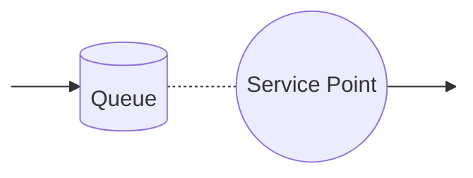

# Performance Variables

In the future, the system will be modelled as a network consisting of the following service points:

The circle represents the service point and the database symbol represents the queue (often we use "striped" rectangle, where one slice in the rectangle represents the customer in the queue). The arrows represent the direction of customers.

## Variables to be observed

Directly observable variables are:
- A, arrived clients count (arrival count)
- C, clients serviced count (completed count)
- B, active time in service point (busy time)
- T, total simulation time (time)

Derived variables (from the previous variables) are:
- U, service point utilization related to the max capasity, U = B/T
- X, service throughput, number of clients serviced related to the time, X = B/T
- S, service time, average service time in the service point, S = B/C

Additional directly observable variables are:
- R𝑖, response time, the time from the customer's arrival at the service queue to the end of the service (𝑖 indicates that this is the lead time experienced by a given customer).
- W, waiting time. cumulative sum of response times of all clients

From these last two, we can further derive the following quantities:
- R, response time, average throughput time at the service point, R = W/C
- N, average queue length at the service point (including the served) N = W/T

## Performance variables in the simulator

The idea is that the simulator will study the behaviour of the system using the above quantities. Calculations are performed at the correct points during the simulation. As the simulation progresses, or at the very end, the values of the observed and derived quantities are printed out.