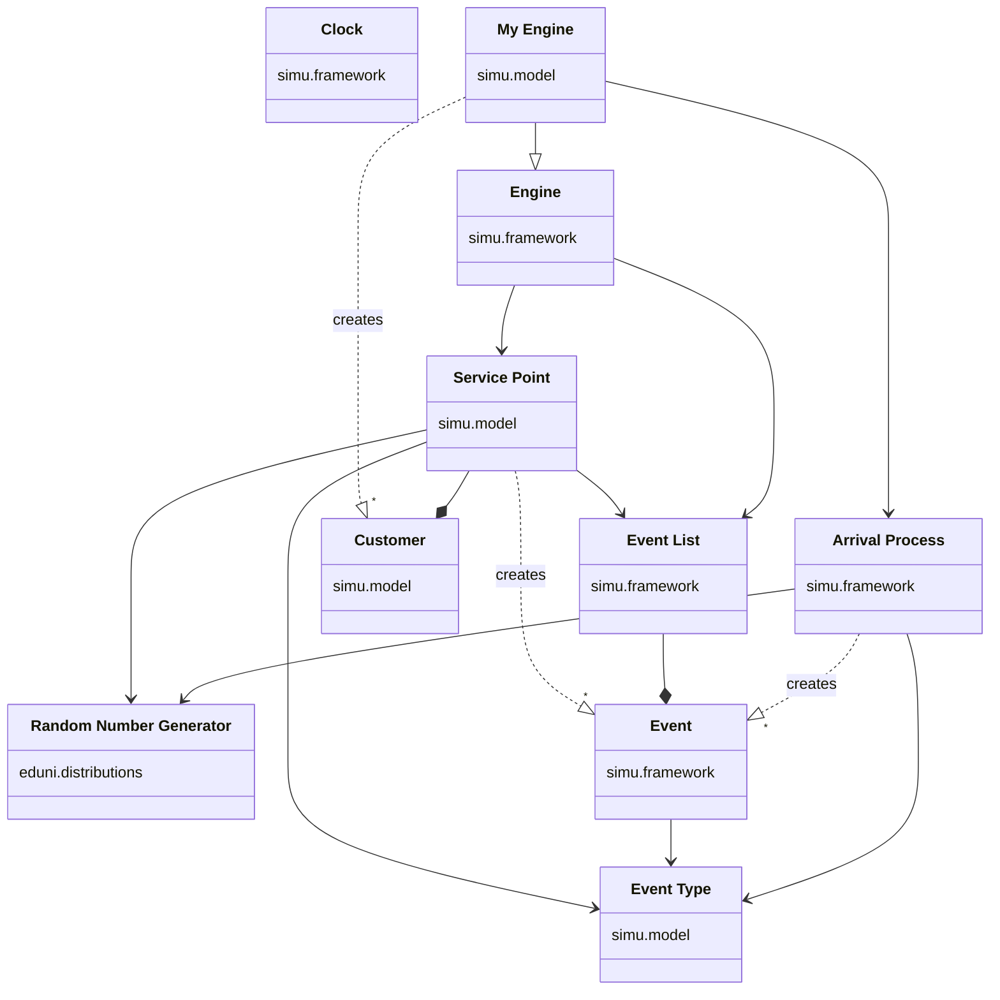

# Random number generation with different distributions

To generate random number sequences following different distributions, the [eduni.distributions](https://www.icsa.inf.ed.ac.uk/research/groups/hase/simjava/distributions/) package developed at the University of Edinburgh can be used. Its source code is a jar file in the Documents folder of the workspace. You can unzip it and include it in your own project as an `eduni.distributions` package. The API documentation for the package is directly available at [here](https://www.dcs.ed.ac.uk/home/simjava/distributions/doc/eduni/distributions/package-summary.html).

## Discrete and continuous distributions

Looking at the documentation, we see that all random number generators implementing different distributions implement two different interfaces: the [ContinuousGenerator](https://www.dcs.ed.ac.uk/home/simjava/distributions/doc/eduni/distributions/ContinuousGenerator.html) and the [DiscreteGenerator](https://www.dcs.ed.ac.uk/home/simjava/distributions/doc/eduni/distributions/DiscreteGenerator.html), each of which has a `sample()` method defined to return the next random number. This allows the service time distribution of a service point to be defined, for example, in the `ContinuousGenerator` interface, and the distribution used can be easily changed to. Discrete distributions produce integers and continuous distributions produce floating-point numbers.

Using the package, Bernoulli-distributed random numbers are generated like this:
```Java
import eduni.distributions.Bernoulli;

...
Bernoulli source = new Bernoulli(0.7);
for (int i=0; i<10; i++) {
    System.out.println("sample "+i+"=" + source.sample());
}
...
```

## Predictable variablity

Above we have discussed variability, which is random. Some of the variability associated with phenomena is predictable. This is the case, for example, with the number of employees when pre-arranged shifts are followed. **No random numbers** are needed to model predictable variability, but such predictable events can be directly coded as B-events or can affect the conditions of C-events.

# Singleton

A Singleton in Java is a design pattern used to ensure that a class has only one instance and provides a global point of access to that instance. This pattern is particularly useful when exactly one object is needed to coordinate actions across the system, such as managing a connection to a database or a logging mechanism. Singleton is used in the simulator for this course. Namely, there is a need for a Clock-object, which indicates the wall clock time of the simulation. Exactly one such clock is needed.

To implement the Singleton pattern, a class typically follows these characteristics:

1. **Private Constructor**: The class has a private constructor to prevent external instantiation of the class.

2. **Static Instance**: The class contains a static member that holds the unique instance of the class.

3. **Public Access Method**: The class provides a public static method to access the instance, typically named `getInstance()`, which returns the unique instance.

Here's a simple example of a Singleton implementation in Java:

```java
public class Singleton {
    // Private static member to hold the unique instance
    private static Singleton instance;

    // Private constructor to prevent instantiation from outside
    private Singleton() {
        // Initialization code
    }

    // Public static method to access the unique instance
    public static Singleton getInstance() {
        if (instance == null) {
            instance = new Singleton();
        }
        return instance;
    }

    // Other methods and properties of the Singleton class
}
```

In this example:
- The `getInstance()` method is responsible for creating the instance if it doesn't exist or returning the existing instance.
- The constructor is private, preventing external code from creating instances directly.
- The `instance` variable is static, ensuring that there's only one instance shared across all calls to `getInstance()`.

It's important to note that this basic implementation is not thread-safe. In a multithreaded environment, multiple threads could potentially create multiple instances. To make the Singleton pattern thread-safe, you can use synchronization techniques or other mechanisms like the [Bill Pugh Singleton](https://www.digitalocean.com/community/tutorials/java-singleton-design-pattern-best-practices-examples) or [Enum Singleton](https://medium.com/geekculture/singleton-pattern-using-enum-in-java-597067f24ad0).

# Classes of the simulator

<!-- https://mermaid.js.org/syntax/classDiagram.html -->



## Clock

Maintains the simulator wall clock time. Progresses in jumps based on event times. If you change the time somewhere, it will be visible everywhere. Implemented as a Singleton.

## Customer

Moves to different places in the simulator. It may contain timestamps. On of the most important timestamp is when arrived to the system.

## Event, Event type, Event list

An event is associated with the time (when the event takes place) and the type of event. The type of event indicates the nature of the event: e.g.
- the customer enters the system
- the customer leaves the service point (service complete) and may move to a new queue immediately (no new transaction required) or after some time (new transaction required).

Events are kept in the Event List (a priority queue is required).

## Arrival process

Bring new customers to the system. Not technically a process (not implemented as a thread), but implemented as a regular class that provides a method to create a new arrival event.

## Random number generators

To implement randomness in different parts of the system. Typically, these are used to calculate arrival delays or event durations.

## Service points

Service points provide service. The service has a duration. A service point is associated with a queue (`LinkedList`). The first customer in the queue is served. When a customer leaves the queue, the next service is started (if there is a next customer in the queue).

The performance of service points can be studied as shown in the previous [section](1.4_Performance_Variables.md).

