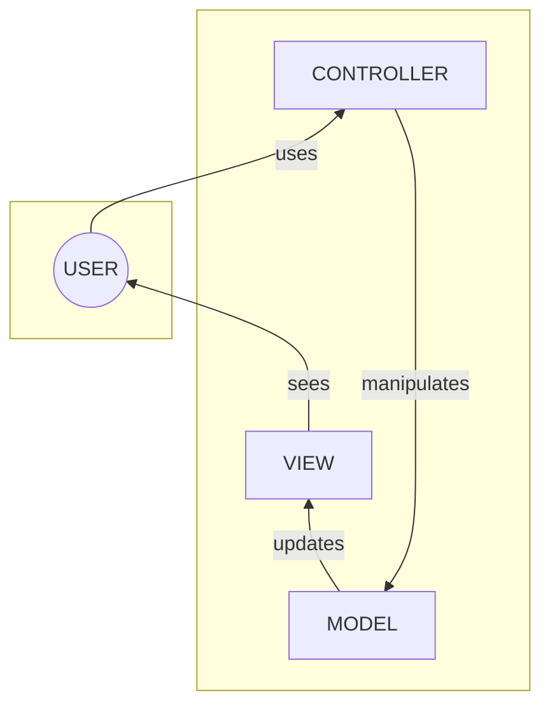

# MVC Design Pattern



MVC, which stands for [Model-View-Controller](https://en.wikipedia.org/wiki/Model%E2%80%93view%E2%80%93controller#:~:text=Model%E2%80%93view%E2%80%93controller%20(MVC,and%20accepted%20from%20the%20user.), is a popular design pattern used in software development to structure an application in a way that separates its concerns, making it easier to manage and maintain. In Java programming, MVC is widely utilized to organize the codebase effectively and achieve a clean and modular design. Let's delve into a brief introduction to MVC in the context of Java programming:

### Model-View-Controller (MVC) Design Pattern in Java

**1. ** **Model (M):**
- The Model represents the application's data and business logic. It encapsulates the application's state and behavior, ensuring that it remains independent of the user interface (View) and the user interactions (Controller).
- In a Java application, the Model is often implemented using classes that handle data storage, retrieval, and manipulation.

**2. View (V):**
- The View is responsible for presenting the data from the Model to the user and collecting user input. It displays the information and communicates any user actions back to the Controller.
- In Java, the View is typically implemented using GUI components like Swing or JavaFX, which present the data in a user-friendly interface.

**3. Controller (C):**
- The Controller acts as an intermediary between the Model and the View. It receives user input from the View, processes it, and updates the Model accordingly. It also updates the View based on changes in the Model.
- In Java, the Controller is implemented as a Java class that manages the application's flow, processes user input, and updates the Model and View accordingly.

### How MVC Works in Java:

1. **User Interaction:**
    - A user interacts with the application through the View, initiating actions like button clicks or data input.

2. **View Notifies Controller:**
    - The View notifies the Controller of these user actions, providing necessary information.

3. **Controller Processes Input:**
    - The Controller receives the input, processes it, and decides how to handle the action.

4. **Controller Updates Model:**
    - The Controller interacts with the Model, updating its state or requesting data based on the user action.

5. **Model Notifies View:**
    - The Model notifies the View of any changes in its state.

6. **View Fetches Updated Data:**
    - The View fetches the updated data from the Model and updates its display accordingly.

By following this pattern, the application's code is structured in a way that separates concerns, making it easier to maintain, extend, and collaborate on. The Model remains independent, the View is responsible for the user interface, and the Controller manages the interactions and flow of the application. This separation enhances code reusability and scalability in Java programming.


## A MVC Example

Let's create a simple Java example using the MVC pattern for a basic application that calculates the square of a number. We'll have three main components: Model, View, and Controller.

### Model:
```java
// Model.java
public class Model {
    private int number;

    public void setNumber(int number) {
        this.number = number;
    }

    public int getSquare() {
        return number * number;
    }
}
```

### View:
```java
// View.java
public class View {
    public void displaySquare(int number, int square) {
        System.out.println("Square of " + number + " is: " + square);
    }

    public int getUserInput() {
        Scanner scanner = new Scanner(System.in);
        System.out.print("Enter a number: ");
        return scanner.nextInt();
    }
}
```

### Controller:
```java
// Controller.java
public class Controller {
    private Model model;
    private View view;

    public Controller(Model model, View view) {
        this.model = model;
        this.view = view;
    }

    public void calculateSquare() {
        int number = view.getUserInput();
        model.setNumber(number);

        int square = model.getSquare();
        view.displaySquare(number, square);
    }
}
```

### Main Application:
```java
// MainApp.java
public class MainApp {
    public static void main(String[] args) {
        Model model = new Model();
        View view = new View();
        Controller controller = new Controller(model, view);

        controller.calculateSquare();
    }
}
```

In this example, we have a Model that represents the data and business logic (calculating the square). The View displays the input prompt and the result, while the Controller acts as an intermediary between the Model and the View, managing the application flow.

When you run `MainApp`, it will ask the user to input a number, calculate the square using the Model, and display the result using the View. This structure adheres to the MVC pattern, keeping concerns separated and promoting a clean and modular design.