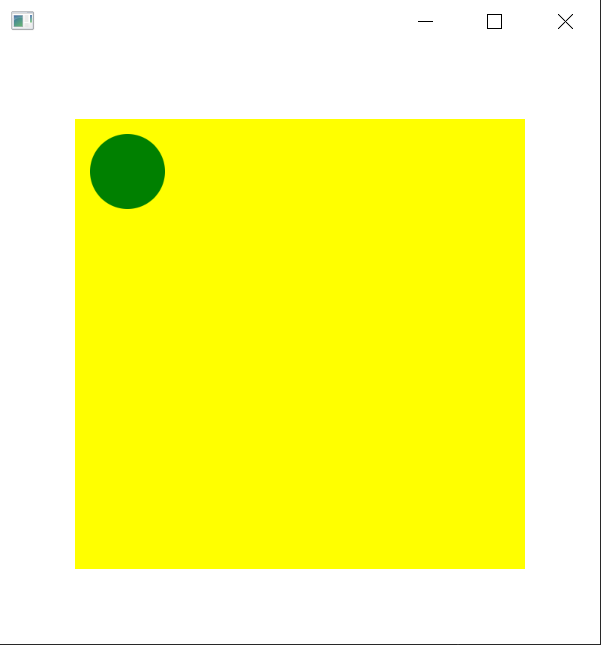
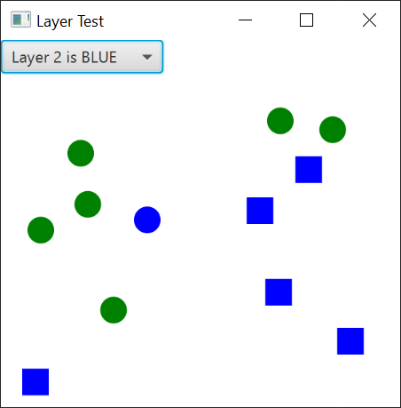

# 2D-Graphics

## Generating graphics (in Java)

This section looks at how graphics can be used to visualize data. The starting point is the Model-View approach, where the data to be displayed is located in some model data structure or is generated by a thread representing the model. The view is implemented in the Canvas component. Even simple graphical components, such as circles and rectangles, can be used to implement a visualization. This can be used, for example, to represent the flow of customers in a world modeled by a simulator.

### Dimensions in JavaFX

Dimensions is JavaFX are represented as pixels. Sometimes it is useful to find out the size of the computer screen we are running our application. This is not possible using JavaFX, but using the old Java AWT graphics, it can be done:
```Java
Dimension screenSize = java.awt.Toolkit.getDefaultToolkit().getScreenSize();
System.out.println("Screen size, width " + screenSize.width + ", height " + screenSize.height);
```

### Canvas and graphic context

Graphics are generated in the `javafx.scene.canvas.Canvas` component. It is a drawing board on which you can draw patterns using the drawing routines of the `javafx.scene.canvas.GraphicsContext` [class](https://docs.oracle.com/javase/8/javafx/api/javafx/scene/canvas/GraphicsContext.html). The drawing routines select the drawing color and the image to be drawn, e.g.:
```Java
private GraphicsContext gc;  // Canvas has only one of these

gc.setFill(Color.YELLOW);    // control the color
gc.fillRect(0, 0, 20, 30);   // shape (rectangle), position (x and y), width and height
```

The canvas is a rectangle and its size can be specified as a parameter of its constructor. The canvas component has no background and it is transparent.  If you want a background color for the Canvas, it can be placed on a self-sized background (Pane) with a color, or in some cases, it can be filled with a self-sized colored rectangle. The graphics context of the Canvas can be obtained with `getGraphicsContext2D()`.
```Java
private Canvas layer = new Canvas(300, 250);
private GraphicsContext gc = layer.getGraphicsContext2D();
```

You should define a subclass for Canvas (modularity and MVC); below the Display class inherits the Canvas-class:
```Java
public class Display extends Canvas {
	   private int x = 40;
	   private int y = 60;
	   private final GraphicsContext gc;

	   public Display(int w, int h) {
	       super(w, h);
	       gc = this.getGraphicsContext2D();
	   }

	   public void drawBall(){
	      gc.setFill(Color.GREEN);
	      gc.fillOval(x, y , 50, 50);
	   }
}
```
We use non-access modifier `final` to inform the compiler that the variable `gc` is constant after it has been initialized in the constructor. This helps Java compiler optimizer to improve (e.g., faster code) the code produced. 

### Updating Node objects attached to the Scene objects

[Node objects](https://jenkov.com/tutorials/javafx/node.html) can be built and modified from any thread as long as they are not connected to the Scene. After they are attached to Scene, they may only be processed in the JavaFX Application Thread.

Canvas is a subclass of Node, so it can only be modified (i.e., changed) in the JavaFX thread. The standard TextField components are also Nodes (see [JavaFX API](https://docs.oracle.com/javase/8/javafx/api/toc.htm)). However, there is a `Platform.runLater()` method which can be called from the encoded thread itself, and which can be used to direct a `Runnable` implementer that modifies a Node object to execute on a JavaFX thread, see example below:
```Java
public void run() {   // Own Thread
    while (fRunning) {
        if (Math.random() <= 0.5)
            Platform.runLater(new Runnable() {  // move to JavaFX thread
                 public void run() {
                    display.moveBall(2,0);      // Canvas update
                 }
            });
        else …
```
using Lambdas it can be written as:
```Java
public void run() {   // Own thread
    while (fRunning) {
        if (Math.random() <= 0.5)
            Platform.runLater(() -> display.moveBall(2,0));  // Canvas update
	…
```
This takes advantage of Java's functional programming feature, where the method call (`display.moveBall(2,0)`) can be passed as such to the method as a parameter instead of an anonymous entity. Works in cases where the anonymous entity (in this case, the thread implementing the `Runnable` interface) has exactly one interface method (i.e., `run()` in this case).

#### Ball example core

In this example, we generate a simple graphical object (green ball) over another object (yellow rectangle).


First, we will create the `Scene` to hold the drawing area.
```Java
import javafx.application.Application;
import javafx.stage.Stage;
import javafx.scene.Scene;
import javafx.scene.layout.BorderPane;

public class UI extends Application {
	@Override
	public void start(Stage primaryStage) {
		try {
			BorderPane root = new BorderPane();
			Scene scene = new Scene(root,400,400);
			DrawingArea area = new DrawingArea(300,300);
			root.setCenter(area);
			primaryStage.setScene(scene);
			primaryStage.show();
			
			area.drawBall();
		} catch(Exception e) {
			e.printStackTrace();
		}
	}
}
```
Then we are able to start the application.
```Java
public class Main {
    public static void main(String[] args) {
        UI.launch(UI.class);
    }
}
```

```Java
import javafx.scene.canvas.Canvas;
import javafx.scene.canvas.GraphicsContext;
import javafx.scene.paint.Color;

public class DrawingArea extends Canvas {
	private int x = 10;	// Position of the ball
	private int y = 10;	// upper-left corner of the rectangle containing the ball
	private final GraphicsContext gc;

	public DrawingArea(int w, int h) {
		super(w, h);
		gc = this.getGraphicsContext2D();
	}

	public void drawBall(){
		gc.setFill(Color.YELLOW);
		gc.fillRect(0, 0 , this.getWidth(), this.getHeight());
		gc.setFill(Color.GREEN);
		gc.fillOval(x, y, 50, 50);
	}
}
```

#### Moving ball example code

In this example code, we have continuously moved ball bouncing at the corners. First we create the `Scene` and start a separate thread to operate the position of the moving ball.
```Java
import javafx.application.Application;
import javafx.application.Platform;
import javafx.event.EventHandler;
import javafx.stage.Stage;
import javafx.stage.WindowEvent;
import javafx.scene.Scene;
import javafx.scene.layout.BorderPane;


public class UI extends Application {
	@Override
	public void start(Stage primaryStage) {
		try {
			BorderPane root = new BorderPane();
			Scene scene = new Scene(root,400,400);
			DrawingArea area = new DrawingArea(300,300);
		  
			root.setCenter(area);
			primaryStage.setScene(scene);
			primaryStage.show();

			primaryStage.setOnCloseRequest(new EventHandler<WindowEvent>() {
			    @Override
			    public void handle(WindowEvent t) {
			        Platform.exit();
			        System.exit(0);
			    }
			});

			BallThread ballThr = new BallThread(area);
			ballThr.start();
		} catch(Exception e) {
			e.printStackTrace();
		}
	}
}
```

Movement of the ball is done on a separate thread. When the new position is ready, it is given to the main thread using the `Platform.runLater()` function call.
```Java
import javafx.application.Platform;

public class BallThread extends Thread{
	    private DrawingArea area = null;
	    private volatile boolean fRunning = true;
		volatile int dx = 1, dy = 1;
	    public BallThread(DrawingArea pa){
	        area = pa;
	    }

	    @Override
	    public void run() {
	        while (fRunning) {
				if (area.xCollision()) {
					dx = -dx;
					if (Math.random() <= 0.2)
						dy = -dy;
				}
				if (area.yCollision()) {
					dy = -dy;
					if (Math.random() <= 0.2)
						dx = -dx;
				}

				Platform.runLater(new Runnable() {
					int finalDx = dx;
					int finalDy = dy;
					public void run(){
						area.moveBall(finalDx, finalDy);
					}
				});

	            try {
	                sleep(10);
	            } catch(InterruptedException e) {
	                e.printStackTrace();
	            }
	        }
	    }

	    public void terminate(){
	        fRunning = false;
	    }
	}
```

Here we will do the actual drawing work.
```Java
import javafx.scene.canvas.Canvas;
import javafx.scene.canvas.GraphicsContext;
import javafx.scene.input.MouseEvent;
import javafx.scene.paint.Color;
import javafx.event.EventHandler;

public class DrawingArea extends Canvas {
	private int x = 40;
	private int y = 60;
	private boolean xCollision = false;
	private boolean yCollision = false;
	private final GraphicsContext gc;

	public DrawingArea(int w, int h) {
		super(w, h);
		gc = this.getGraphicsContext2D();
				
		this.setEventHandler(MouseEvent.MOUSE_CLICKED, new EventHandler<MouseEvent>() {
			@Override
			public void handle(MouseEvent e) {
				newPosition((int) e.getX(), (int) e.getY());
			}
		});
	}

	private void clrDisplay() {
		gc.setFill(Color.YELLOW);
		gc.fillRect(0, 0, this.getWidth(), this.getHeight());
	}

	public void drawBall() {
		clrDisplay();
		gc.setFill(Color.GREEN);
		gc.fillOval(x, y, 30, 30);
	}

	private boolean xCollision(int x) {
		return x < 0 || x > this.getWidth() - 30;
	}

	public boolean xCollision() {
		return xCollision;
	}

	private boolean yCollision(int y) {
		return y < 0 || y > this.getHeight() - 30;
	}

	public boolean yCollision() {
		return yCollision;
	}

	public void moveBall(int dx, int dy) {
		if (!xCollision(x+dx)) {
			x += dx;
			xCollision = false;
		} else
			xCollision = true;

		if (!yCollision(y+dy)) {
			y += dy;
			yCollision = false;
		} else
			yCollision = true;

		drawBall();
	}

	public void newPosition(int x, int y) {
		if (!xCollision(x) && !yCollision(y)) {
			this.x = x;
			this.y = y;
			drawBall();
		}
	}
}
```
Starting the application is done using the same `Main` class than in the Ball example.

### Layers of canvas objects

Layers in JavaFX are essentially different levels or groupings of nodes within the scene graph. These layers allow you to control the rendering order of nodes and manage their visibility, making it easier to organize and manage complex UIs.

Typically, you might have different layers for various elements of your application, such as a background layer for static or non-interactable elements, an intermediate layer for interactive elements like buttons, and a top layer for pop-ups or overlays.

By structuring your UI into layers, you can better manage the rendering and interactions of nodes, providing a more efficient and visually appealing user experience.



You can create several canvases of the same size (which can be layered), e.g.:
```Java
/*
 * Copyright (c) 2012 Oracle and/or its affiliates.
 * All rights reserved. Use is subject to license terms.
 *
 * This file is available and licensed under the following license:
 *
 * Redistribution and use in source and binary forms, with or without
 * modification, are permitted provided that the following conditions
 * are met:
 *
 *  - Redistributions of source code must retain the above copyright
 *    notice, this list of conditions and the following disclaimer.
 *  - Redistributions in binary form must reproduce the above copyright
 *    notice, this list of conditions and the following disclaimer in
 *    the documentation and/or other materials provided with the distribution.
 *  - Neither the name of Oracle nor the names of its
 *    contributors may be used to endorse or promote products derived
 *    from this software without specific prior written permission.
 *
 * THIS SOFTWARE IS PROVIDED BY THE COPYRIGHT HOLDERS AND CONTRIBUTORS
 * "AS IS" AND ANY EXPRESS OR IMPLIED WARRANTIES, INCLUDING, BUT NOT
 * LIMITED TO, THE IMPLIED WARRANTIES OF MERCHANTABILITY AND FITNESS FOR
 * A PARTICULAR PURPOSE ARE DISCLAIMED. IN NO EVENT SHALL THE COPYRIGHT
 * OWNER OR CONTRIBUTORS BE LIABLE FOR ANY DIRECT, INDIRECT, INCIDENTAL,
 * SPECIAL, EXEMPLARY, OR CONSEQUENTIAL DAMAGES (INCLUDING, BUT NOT
 * LIMITED TO, PROCUREMENT OF SUBSTITUTE GOODS OR SERVICES; LOSS OF USE,
 * DATA, OR PROFITS; OR BUSINESS INTERRUPTION) HOWEVER CAUSED AND ON ANY
 * THEORY OF LIABILITY, WHETHER IN CONTRACT, STRICT LIABILITY, OR TORT
 * (INCLUDING NEGLIGENCE OR OTHERWISE) ARISING IN ANY WAY OUT OF THE USE
 * OF THIS SOFTWARE, EVEN IF ADVISED OF THE POSSIBILITY OF SUCH DAMAGE.
 */

import javafx.*;

public class LayerTest extends Application {
	private Group root;
	private BorderPane borderPane;
	private Canvas layer1;
	private Canvas layer2;
	private GraphicsContext gc1;
	private GraphicsContext gc2;
	private ChoiceBox<String> cb;

	private void createLayers() {
		// Layers 1&2 are the same size
		layer1 = new Canvas(300, 250);
		layer2 = new Canvas(300, 250);

		// Obtain Graphics Contexts
		gc1 = layer1.getGraphicsContext2D();
		gc1.setFill(Color.GREEN);
		gc1.fillOval(50, 50, 20, 20);
		gc2 = layer2.getGraphicsContext2D();
		gc2.setFill(Color.BLUE);
		gc2.fillOval(100, 100, 20, 20);
	}

	private void handleLayers() {
		// Handler for Layer 1
		layer1.addEventHandler(MouseEvent.MOUSE_PRESSED, new EventHandler<MouseEvent>() {
			@Override
			public void handle(MouseEvent e) {
				gc1.fillOval(e.getX(), e.getY(), 20, 20);
			}
		});

		// Handler for Layer 2
		layer2.addEventHandler(MouseEvent.MOUSE_PRESSED, new EventHandler<MouseEvent>() {
			@Override
			public void handle(MouseEvent e) {
				gc2.fillRect(e.getX(), e.getY(), 20, 20);
			}
		});
	}

	private void createChoiceBox() {
		cb = new ChoiceBox<String>();
		cb.setItems(FXCollections.observableArrayList("Layer 1 is GREEN", "Layer 2 is BLUE"));
		cb.getSelectionModel().selectedItemProperty().addListener(new ChangeListener<Object>() {
			@Override
			public void changed(ObservableValue<?> o, Object o1, Object o2) {
				if (o2.toString().equals("Layer 1 is GREEN")) {
					layer1.toFront();
				} else if (o2.toString().equals("Layer 2 is BLUE")) {
					layer2.toFront();
				}
			}
		});
		cb.setValue("Layer 1 is GREEN");
	}

	private void addLayers() {
		// Add Layers
		borderPane.setTop(cb);
		Pane pane = new Pane();
		pane.getChildren().add(layer1);
		pane.getChildren().add(layer2);
		layer1.toFront();	
		borderPane.setCenter(pane);
		root.getChildren().add(borderPane);
	}

	@Override
	public void start(Stage primaryStage) {
		// Build GUI
		borderPane = new BorderPane();
		primaryStage.setTitle("Layer Test");
		root = new Group();
		createLayers();
		handleLayers();
		createChoiceBox();
		addLayers();

		// Show Scene
		Scene scene = new Scene(root);
		primaryStage.setScene(scene);
		primaryStage.show();
	}
}
```

The Canvas objects created separately (in the `addLayers()` method) are initially attached to the Pane platform, which has no layout, and attached to the middle of the BorderPane platform. It is further connected to the root component, which in this example is the Group component.

## Events

In JavaFX, events play a crucial role in enabling interactivity within graphical user interfaces (GUIs). Events are occurrences within a program, such as user actions like mouse clicks, keyboard presses, or interactions with graphical elements like buttons. JavaFX provides a comprehensive event handling mechanism to respond to these events and trigger appropriate actions in your application.

### Mouse events

For example, you can add a mouse event handler to the Canvas layer:
```Java
layer1.addEventHandler(MouseEvent.MOUSE_PRESSED, new EventHandler<MouseEvent>() {
	@Override
	public void handle(MouseEvent e) {
		gc1.fillOval(e.getX(), e.getY(), 20, 20);
	}
});
```
This is the processing of an event in an anonymous inner class. `MouseEvent` contains, among other things, information about the location where the mouse was clicked (x and y).

### ChoiceBox

```Java
private void createChoiceBox() {
	cb = new ChoiceBox<String>();
	cb.setItems(FXCollections.observableArrayList("Layer 1 is GREEN",  "Layer 2 is BLUE"));
	cb.getSelectionModel().selectedItemProperty().addListener(new ChangeListener<Object>() {
		@Override
		public void changed(ObservableValue<?> o, Object o1, Object o2) {
			if (o2.toString().equals("Layer 1 is GREEN")) {
				layer1.toFront();
			} else if (o2.toString().equals("Layer 2 is BLUE")) {
				layer2.toFront();
			}	
		}
	});
	cb.setValue("Layer 1 is GREEN");
}
```

### Events from SceneBuilder controls

In SceneBuilder, you can define the event handler in the Controller class (which you define in SceneBuilder). The event handler is a method called when the event occurs. The method must have the same name as the event handler defined in SceneBuilder. The method must have the `@FXML` annotation, and the method must be public. You can use the `ActionEvent` class to handle the event.

```Java
public void handleStart(ActionEvent event) {
    System.out.println("Button " + ((Button)event.getSource()).getId() + " pressed");
    if (visualisation == null) {
        if (animationSelBox.getValue().equals("Numbers")) {
            visualisation = new Visualisation2(visu);	// Customer info as text
        } else
            visualisation = new Visualisation(visu);	// Customer as a graphical symbol

        visualisation.clearDisplay();
    }
    startButton.setDisable(true);
}
```

The `getId()` method returns the ID of the object that triggered the event. This ID (of the String type) is the same ID as you defined in SceneBuilder. The `getSource()` method returns the object (actually a JavaFX control) that triggered the event. Using the ID, it is possible to identify the control that triggered the event, and use the same event handler for multiple controls.

## SceneBuilder and animation Canvas

In the JavaFX program discussed in this lesson, the animation window is the Visualization class, which inherits from the Canvas class.
If you are using SceneBuilder, one way to do this is as follows:
The fxml definition is done for the Canvas class (not the Visualization class).
In the Documents folder, there is an example Animation.zip where this is done.
The basic idea is that Visualization does not inherit from Canvas, but Visualization refers to Canvas, which is placed as a Canvas node in the UI.
The thread in PanelsController in the example represents the Engine thread in the simulator, where the visualization calls come from.